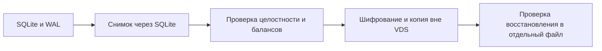

# Резервные копии SQLite: способы и схема для этого бота

Ручные команды создания и проверки копий установлены на сервере. Автоматические
расписание, отправка во внешнее хранилище и очистка копий пока не настроены.

## Согласованные правила хранения

Согласованная копия SQLite **каждую ночь и перед обновлением или очисткой**, проверка
и шифрованное хранение вне VDS. Храним **семь последних успешных ежедневных копий**;
отдельные копии перед изменениями — **30 дней**. Недельные и месячные копии не нужны.
Неудачная попытка не должна вытеснять последнюю исправную копию. Политика согласована,
но расписание, отправка и автоматическая очистка пока не установлены.

Подготовку ведём как [практический курс](backup-course/README.md), по одному
проверяемому этапу. Первая лаборатория использует искусственную локальную базу;
рабочие изменения выполняются на последующих этапах.

Ежедневное копирование допускает потерю данных за период до суток. Если это
неприемлемо, частоту нужно увеличить или использовать непрерывное копирование изменений.
При прогнозе около 20–25 МиБ сама база мала; важнее независимость копий и проверка восстановления.

## Общепринятые способы

| Способ | Работающий бот | Преимущества и ограничения |
| --- | --- | --- |
| SQLite Online Backup API, в том числе CLI `.backup` и Python `Connection.backup` | Можно | Согласованный снимок, учитывает WAL; подходящий основной способ для бота |
| `VACUUM INTO` | Можно | Создаёт согласованную уплотнённую копию; полезно убрать свободные страницы, но требует дополнительных вычислений |
| Копирование файлов после остановки | При остановленных писателях и согласованном состоянии файлов | Просто, но легко забыть WAL или скопировать его не в тот же момент |
| SQL-экспорт `.dump` | Экспортировать согласованно | Удобен для переноса и изучения; восстановление и служебные настройки формата нужно проверять отдельно |
| Снимок диска / VDS | Зависит от механизма снимка | Восстанавливает окружение целиком; нужна согласованность файлов, независимая копия и проверка восстановления |
| Непрерывное копирование SQLite через Litestream | Можно | Меньше потенциальный период потери, но появляется отдельная служба, внешнее хранилище и настройки удержания версий |

Online Backup API копирует состояние через SQLite, а не через произвольное чтение
изменяемых файлов. Возможна пошаговая работа с короткими блокировками; это полезно,
когда приложение продолжает запись. [SQLite Backup API](https://sqlite.org/backup.html).

`VACUUM INTO` пишет новую базу без свободных страниц. Это не то же самое, что
выполнить VACUUM над основной базой; исходная база не заменяется новой копией.
[SQLite VACUUM](https://sqlite.org/lang_vacuum.html).

Для копирования файлов важно, что **WAL может содержать уже подтверждённые записи,
которых ещё нет в основном файле**. Копирование только `settlements.sqlite` из работающей
базы может их потерять. Раздельное копирование основного файла и WAL во время записи
не гарантирует единого момента. Предпочтителен снимок средствами SQLite.
[Режим WAL](https://sqlite.org/wal.html), [риски копирования файлов](https://www.sqlite.org/howtocorrupt.html).

Litestream предназначен для непрерывного резервирования SQLite. Для одной небольшой
группы это дополнительный вариант при требовании терять меньше данных между копиями,
а не обязательная зависимость бота. [Litestream](https://litestream.io/).

## Согласованная цепочка



Внешнее хранилище — отдельный сервер или объектное хранилище. Файл на том же диске
помогает при ошибочном обновлении, но не при потере самой VDS. Общий ориентир 3–2–1:
три копии, разные носители, одна копия вне основной площадки.
[Рекомендации CISA](https://www.cisa.gov/sites/default/files/publications/data_backup_options.pdf).

Для хранения версий и шифрования можно использовать restic; сначала нужно получить
согласованный снимок SQLite, затем передать его в систему резервирования. Архивирование
живого набора файлов само по себе не заменяет согласованную копию базы.
[Примеры restic](https://restic.readthedocs.io/en/stable/080_examples.html).

Код хранится в GitHub. База, её копии и `bot.env` хранятся отдельно. Настройки запуска
и версия приложения нужны для восстановления; секретный файл сохраняется защищённо,
а не в репозитории. Сжатие готовых копий уменьшит занимаемое место, но прогноз выше
намеренно приведён для несжатых файлов.

## Что исправлено в команде приложения

Раньше `backup` и `verify` открывали источник обычным конструктором Database. В новой
версии приложения это могло сначала обновить старую схему, и только потом выполнить
копирование. На искусственной базе воспроизведено изменение версии 1 → 2.

Исправлено:

- источник открывается `mode=ro` и `query_only=ON`, без миграции;
- копирование использует SQLite Online Backup API и сохраняет весь состав базы;
- промежуточный файл создаётся с правами 0600;
- копия проверяется до появления под окончательным именем;
- существующая копия не перезаписывается;
- при ошибке промежуточный файл удаляется, исходная база остаётся нетронутой.

Проверки доказывают сохранение исходной версии и байтов файла, данных из активного
WAL, истории и балансов восстановленной копии. Новый механизм установлен на VDS.
Перед обновлением создан снимок через Python SQLite Backup API, проверен новым
приложением без миграции и сохранён также локально в игнорируемом каталоге data/backups.

Команда установленной версии:

```sh
docker --context default compose -f /opt/tennis-split-bot/compose.yaml exec bot \
  /app/bin/tennis-settlements-bot backup /data/settlements.sqlite /data/backup-YYYY-MM-DD.sqlite
```

Имя должно быть новым. Дальше копию следует вывести из VDS и проверить внешнюю
копию, а не полагаться только на успешный ответ команды.

## Проверка восстановления

1. Восстановить файл в отдельный временный каталог.
2. Выполнить `verify` совместимой версией приложения: целостность, внешние ключи,
   баланс каждой операции и балансы групп.
3. Проверить наличие ожидаемых последних тренировок и переводов, версию схемы и
   соответствующую версию приложения.
4. Тестовую проверку проводить без запуска второго процесса с рабочим токеном Telegram.
5. При настоящем восстановлении сначала остановить бот и сохранить исходные файлы
   для разбора. Возврат старой копии означает потерю записей после момента копирования.

При проверке отдельного снимка в контейнере поместить его временную копию в каталог,
доступный для записи, например /tmp. SQLite может потребовать служебные WAL/SHM-файлы
даже при открытии самой базы только для чтения. Проверка одиночного снимка,
смонтированного в корень контейнера с read_only, при этой выкладке дала SQLITE_CANTOPEN;
проверка его временной копии в /tmp прошла. Исходный снимок не менялся.

Такая проверка нужна после первичной настройки и периодически, например раз в месяц.
Ни расписание, ни место внешнего хранения пока не выбраны и не настроены.

При переходе со схемы4 на схему5 сначала сохранить отдельную согласованную копию.
Старые REVIEW становятся OPEN с отменой прежнего расчёта отдельными проводками.
Откат старой программы требует базы совместимой версии; нельзя заменять текущую
базу старой копией после новых пользовательских действий, иначе они будут потеряны.

Схема6 добавляет личные настройки и глобальные кнопки. Финансовые таблицы не меняются;
черновики создания сохраняют поля и получают выбор группы последним шагом. Перед
обновлением сохраняется согласованная копия; новый код проверяется на её отдельном экземпляре.

## Полный сброс тестового этапа

По явной просьбе владельца рабочие данные можно обнулить, сохранив схему и настройки
запуска. Сначала остановить только бота и сделать согласованную закрытую копию базы.
Затем подтвердить и убрать ожидающие события прежнего тестового этапа в Telegram,
чтобы они не воспроизвелись после очистки. Все прикладные и служебные таблицы очищаются
одной транзакцией с проверкой внешних ключей; после этого выполняются проверка
целостности и освобождение неиспользуемых страниц. Запустить бота и проверить,
что тестовые данные отсутствуют. При запуске появляется служебная запись самого бота.

Сбрасываются также группы, назначения администраторов бота, личные настройки,
черновики и кнопки. Токен в отдельном файле настроек и права администратора,
выданные средствами Telegram, сохраняются. Старые сообщения и закрепы в чатах
не удаляются этой операцией; старые кнопки теряют привязку к базе.
Для следующего этапа отправить `/menu` в каждой нужной группе и `/start` в личном чате.
Резервные копии предыдущего этапа остаются отдельно от пустой рабочей базы.

## Удаление данных одной группы

Процедура удаляет данные выбранной группы из рабочей базы с сохранением остальных групп.

1. Найти группу по точному названию и проверить единственность результата.
2. Проверить удаление на согласованной копии базы: данные всех остальных групп
   и общие аккаунты должны остаться без изменений.
3. Остановить бота, убедиться, что нет незавершённых событий, и сохранить проверенную
   резервную копию. Не удалять данные во время обработки Telegram-событий.
4. В одной транзакции с включёнными внешними ключами удалить связанные записи:
   голоса опросов, проводки, историю, опросы, участников тренировок, переводы,
   назначения администраторов, кнопки, доставки, сессии, события, тренировки,
   членство в группе и саму группу. Проверить вложенные ссылки на группу в JSON.
   Общие аккаунты `users` сохраняются.
5. Сохранить общую позицию чтения обновлений Telegram без привязки к удалённой
   группе, если удаляется событие с максимальным идентификатором. Иначе бот может
   повторно получить ранее обработанные события.
6. До фиксации сравнить оставшиеся строки с исходной копией, проверить внешние
   ключи и целостность. После фиксации при остановленном боте можно выполнить
   контрольную точку WAL и `VACUUM`, затем запустить бот и проверить результат.
7. Сохранить резервную копию вне сервера и проверить совпадение контрольных сумм.
   Конкретные названия групп, идентификаторы и отчёт операции хранить только
   в закрытых эксплуатационных заметках вне Git.

Удаление из рабочей базы не удаляет сообщения Telegram и прежние резервные копии.
Восстановительная копия намеренно содержит данные до удаления; к ней применяется
согласованная политика хранения. Если бот остаётся в группе, новое действие в ней
может создать пустую запись группы заново. Для окончательного прекращения работы
с группой нужно также убрать из неё бота.
