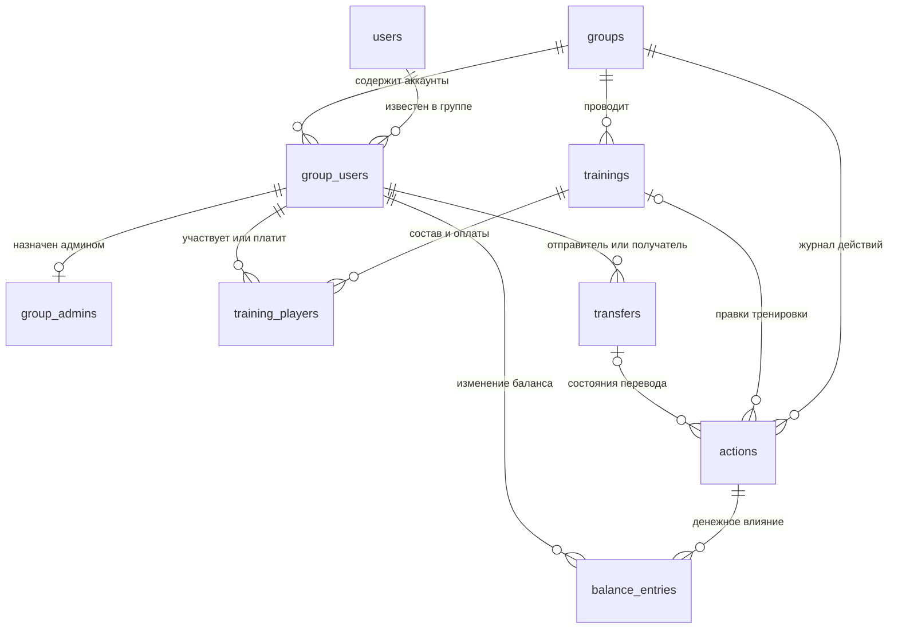
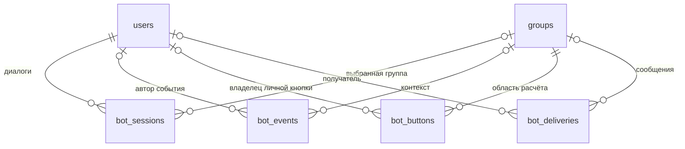

# Новая база: таблицы и связи

Текущий код использует версию схемы 8; таблиц 15. SQL находится в [schema.sql](../src/main/resources/db/schema.sql).
Статус установки — в [DEPLOYMENT_STATUS.md](DEPLOYMENT_STATUS.md).

## Что переиспользуем

| Прежние таблицы | Новая модель | Решение |
| --- | --- | --- |
| tg_users + participants | users + group_users | Аккаунт определяется Telegram ID. Псевдопрофили и привязки удаляются из модели. |
| app_groups + tg_groups | groups | Одна таблица настроек и идентификатора чата. |
| organizers | group_admins | Только назначения администраторов бота; старшая роль проверяется в Telegram. |
| training_drafts + tg_editors | trainings + training_players | Общая тренировка и строки участия. Отдельных личных копий состава нет. |
| group_state | Не нужна | Текущие балансы читаются из проводок, состояния переводов — из transfers. |
| operations + workflow_audit + workflow_commands + outbox | actions | Один журнал команды, её результата и необходимости обновить сообщения. |
| balance_entries | balance_entries | Сохраняем принцип денежных проводок, меняем ссылки на действия и Telegram-аккаунты. |
| tg_updates + tg_plans | bot_events | Одно входящее событие вместе с планом и результатом обработки. |
| tg_sessions | bot_sessions | Диалог конкретного пользователя в конкретном чате. |
| tg_actions + tg_links | bot_buttons | Общий механизм токенов; постоянные ссылки отличаются признаком permanent. |
| tg_deliveries + tg_recoveries | bot_deliveries + действия восстановления в bot_events | Статус отправки и восстановление по идентификатору входящего события. |
| tg_identity | Одна запись аккаунта бота в users | Защита от открытия базы другим ботом без отдельной таблицы. |

Переиспользование здесь означает сохранение полезной модели и проверенных правил.
Физически создаём новый файл SQLite. Старую тестовую базу сохраняем отдельно;
совместимость со старыми экранными командами в новый код не добавляем.

## Общая схема предметных данных

`group_users` — связь аккаунта с учётом конкретной группы. Наличие этой связи
не заменяет проверку членства в Telegram и не означает участие в каждой тренировке.

## 1. users — Telegram-аккаунты

**Одна строка на Telegram-аккаунт во всём боте.**

- `id` — числовой Telegram ID, первичный ключ.
- `first_name`, `last_name`, `username` — последние известные данные для отображения.
- `is_bot` — признак самого бота; допускается одна такая запись.
- `training_title` — личное название новой тренировки, по умолчанию «Теннис».
- `training_time` — личное начало новой тренировки, по умолчанию 18:30.

На неё ссылаются участники групп, авторы действий и технические диалоги.
Один человек может участвовать в нескольких группах с той же записью users.
Username не уникальный ключ базы: он может измениться или перейти к другому аккаунту.

## 2. groups — группы Telegram

**Одна строка на чат, для которого ведутся расчёты.**

- `id` — Telegram chat ID, первичный ключ.
- `title` — название.
- `time_zone` — часовой пояс дат и времени тренировок.
- `polls_enabled` — разрешены ли новые опросы перед тренировками; по умолчанию 0.
- `guests_enabled` — разрешены ли гости в новых тренировках; по умолчанию 1.
- `track_time` — индивидуальный ввод длительности в новых тренировках; по умолчанию 1.
Все три настройки используются в интерфейсе.

С ней связаны group_users, trainings, transfers, actions и техническое состояние.
При переходе чата в супергруппу изменение идентификатора распространяется
по объявленным внешним ключам через `ON UPDATE CASCADE`.

Параметры новой тренировки хранятся у пользователя, а не у группы.

## 3. group_users — аккаунты в учёте группы

**Одна строка на пару «группа + аккаунт».**

- `group_id` → groups.id.
- `user_id` → users.id.
- `present` — последнее известное присутствие в Telegram-группе.
- `attendance_count` — сохранённое число учтённых посещений для сортировки.
- `has_played` — есть подтверждённое участие, включая открытую тренировку; фильтр нулевых балансов.
- `is_attending` — ручной признак «ходит» (1) / «не ходит» (0); по умолчанию 1.
- `nickname` — необязательное имя для отображения в этой группе, от 1 до 64 символов
  без пробелов по краям. NULL означает использование имени Telegram-аккаунта.
- Первичный ключ — `(group_id, user_id)`.

Связь сохраняется после выхода человека из чата, потому что у него могут
остаться долги и история. Признак present нужен для списков; права доступа
проверяются заново через Telegram. Прошлые посещения считаются по тренировкам.
Ручной признак is_attending независим от статистики, членства в чате и участия
в конкретной тренировке. Он не меняет долги и не запрещает присоединяться.
Новый аккаунт по умолчанию считается «ходящим», но не записывается играющим.

**Запланировано, пока не реализовано в интерфейсе и логике бота:** is_attending
и nickname уже предусмотрены в новой SQL-схеме. В дальнейшем первый будет
использоваться для ручного управления списками, второй — для отображения имени.
В разных группах у одного аккаунта могут быть разные признаки и имена.
Nickname не обязан быть уникальным и не заменяет Telegram ID или @username.
Обновление данных из Telegram не должно перезаписывать эти ручные настройки.

## 4. group_admins — назначенные администраторы бота

**Строка появляется только после назначения администратором бота.**

- `(group_id, user_id)` → group_users; одновременно первичный ключ.
- `granted_by` — кто назначил; также аккаунт этой группы.
- `granted_at` — время назначения.

Администратор Telegram-группы автоматически считается суперадминистратором
при проверке запроса, отдельной строки для этого не требуется. Он может
назначать и снимать администраторов бота. Назначенный администратор не выдаёт
права другим. Старшая роль из другой группы не действует здесь.

## 5. trainings — тренировки

**Одна строка на тренировку, сохраняющаяся после исправлений и отмены.**

- Первичный ключ — `(group_id, id)`.
- `title`, `played_on`, `starts_at` — название, дата и начало.
- `status` — OPEN, CLOSED или CANCELLED.
- `version` — версия текущих данных, проверяется при завершении.
- `applied_version` — какая редакция последней была применена к балансам.
- `created_by`, `created_at` — создатель из этой группы и время создания.
  `created_by` определяет право учёта наряду с ролью администратора этой группы.
  Авторство включает запись в «Мои тренировки» только в OPEN; после учёта
  нужны обычные основания участия или оплаты. Новые поля для этой роли не нужны.

Состав и оплаты находятся в training_players, правки — в actions, денежное
влияние — в balance_entries. При повторном открытии учтённой тренировки её прежний вклад в баланс
снимается компенсирующей операцией; фактические переводы не меняются.

## 6. training_players — участие, время и оплата

**Одна строка на Telegram-аккаунт в конкретной тренировке.**

- `(group_id, training_id)` → trainings.
- `(group_id, user_id)` → group_users.
- Первичный ключ — `(group_id, training_id, user_id)`.
- `playing` — играет ли сейчас по введённым данным.
- `minutes` — время; по умолчанию 0, неотрицательное число с шагом 30 минут.
- `guest_count` — число гостей, от 0 до 99.
- `guest_minutes` — время каждого гостя; новый ввод синхронизирует его с minutes.
  Отдельное старое гостевое время сохраняется при миграции до следующей правки участия.
- `paid` — оплата стола в целых рублях, не перевод другому участнику.
- `ordinal` — стабильный порядок для распределения остатка округления.
- `applied_playing` — участвовал ли в последней завершённой редакции.

Последнее поле отмечает участие в действующем учтённом расчёте. При завершении
оно обновляется, при открытии заново или отмене сбрасывается.

Пользовательское присоединение создаёт строку сразу с 0 ч и 0 ₽. Последующие
кнопки изменяют её сразу. «Не участвую» удаляет строку вместе с оплатой, временем
и гостями. История до / после остаётся в actions.
У гостей нет собственных аккаунтов: их расходы суммируются на пригласившем.
Текущая панель управления игроком тоже применяет выход сразу.

## 7. transfers — переводы между людьми

**Одна строка на платёж, отмеченный отправителем или записанный администратором.**
Прежние записи сохранены.

- Первичный ключ — `(group_id, id)`.
- `from_user`, `to_user` — стороны из group_users той же группы.
- `amount`, `occurred_on`, `note` — целые рубли, дата отправки по часовому поясу
  группы и прежний комментарий; новый интерфейс комментарий не вводит.
- `status`: REVIEW — «В процессе», ACTIVE — «Выполнен».
  CANCELLED сохранён для архивных отменённых записей и не входит в новую историю.
- `version` — версия состояния, увеличивается при принятии.
- `reviewer`, `review_party` — прежние служебные имена. Для нового REVIEW оба равны
  отправителю, при принятии очищаются. Это не право подтверждения: оно определяется
  строго по `to_user` и актуальному членству в группе.
- `created_by`, `created_at` — автор записи (отправитель либо администратор) и время создания.

`SendPayment` проверяет актуальное предложение в транзакции и создаёт REVIEW без
проводок. `SendOtherPayment` записывает произвольную положительную сумму от
текущего участника другому известному аккаунту этой группы; одинаковые отправитель,
получатель и сумма за сутки требуют явного разрешения повторной записи.
`ReceivePayment` доступна только получателю и переводит REVIEW в ACTIVE, добавляя
проводки один раз. Ожидание учитывается только при построении предложений отправки.

`RecordAdminPayment` требует текущего членства и прав администратора этой группы.
Она сразу создаёт ACTIVE и проводки между любыми двумя разными известными аккаунтами
группы. `created_by` хранит автора, тип команды в `actions.kind` отличает такую
запись от отправки самим участником. Отдельный столбец для признака администратора
не нужен: происхождение операции неизменно записано в журнале.

Новые платежи не допускают старые команды изменения / уточнения; административная
запись не ожидает получателя и не оспаривается. Счётчик — COUNT переводов REVIEW
по группе и `to_user`. Все операции, в том числе проверка повторов и допустимого
диапазона итоговых сумм, выполняются транзакционно; повтор события не добавляет
ни перевод, ни проводки второй раз.

Схема остаётся 6, новых таблиц и миграции нет. Личный ввод хранится в существующем
`bot_sessions.input_json`: виды `payment_from`, `payment_to`, `payment_amount`,
`payment_ready`, `payment_duplicate`; `paymentFrom` — отправитель, `user` — получатель,
`adminPayment` — административный путь. Подпись формы защищает от старых кнопок.
Права формы не заменяют повторную проверку прав в финансовой команде.

## 8. actions — единый журнал действий

**Одна строка на успешно обработанную предметную команду.**

- `id` — первичный ключ записи журнала.
- `group_id`, `actor_id` — группа и реальный автор из этой группы.
- `request_id` — уникален внутри группы; повтор возвращает тот же результат.
- `kind` — вид действия.
- `training_id` или `transfer_id` — ссылка на затронутую запись; оба одновременно запрещены.
- `payload_json` — исходная команда для проверки совпадения при повторе.
- `before_json`, `after_json` — история изменения, а не основное хранилище текущих данных.
- `result_version` — сохранённая версия результата.
- `occurred_at` — время записи.
- `needs_delivery`, `delivered_at` — требуется ли обновить карточку/уведомления и обработано ли это.

Правка времени сама по себе не создаёт денежных проводок. Завершение
тренировки, отмена и операции с переводами создают связанные balance_entries.
Из нескольких быстрых правок можно обновить общую карточку один раз, взяв
последнее состояние. Результаты конкретных отправок находятся в bot_deliveries.

## 9. balance_entries — финансовые проводки

**Одна строка — изменение баланса одного аккаунта от одного действия.**

- `(group_id, action_id)` → actions.
- `(group_id, user_id)` → group_users.
- `entry_index` — номер строки внутри действия.
- `amount` — сумма со знаком: плюс означает, что человеку должны.
- Первичный ключ — `(action_id, entry_index)`.

Сумма по участнику и группе — текущий баланс. Сумма проводок одного действия
должна быть нулевой; это проверяет код внутри транзакции и проверка целостности.
Внешние ключи защищают принадлежность группе, но арифметическое равенство
нескольких строк не выражается простым CHECK отдельной строки.

При исправлении тренировки снимается её накопленное влияние и добавляется
новое. Проводки переводов при этом не затрагиваются. Проверка переполнения
выполняется точной целочисленной арифметикой.

## Технические связи

## 10. bot_events — входящие события Telegram

**Одна строка на update_id.**

- `update_id` — первичный ключ.
- `user_id`, `group_id` — контекст, если применим.
- `plan_json` — зафиксированное действие для продолжения после сбоя.
- `completed` — обработка завершена.

Эта таблица заменяет отдельные таблицы обновлений и планов. Повтор получения
одного update_id не добавляет деньги второй раз. Два настоящих нажатия +100 ₽
имеют разные update_id и увеличивают сумму дважды.

## 11. bot_sessions — текущие диалоги

**Одна строка на пару «пользователь + чат общения».**

- Первичный ключ — `(user_id, chat_id)`.
- `group_id` — выбранная расчётная группа; для общего меню и создания до публикации — NULL.
- `message_id` — текущее обычное сообщение.
- `ephemeral_id` — персональное представление внутри группы, если используется.
- `input_json` — ожидаемый ответ или черновик формы создания или административной правки.
- `panel_json` — ScreenAction текущей персональной панели; очищается при закрытии.

Для формы администратора используется один черновик на редактора и группу.
Он хранит исходную и редактируемую строку одного игрока, защищая её от перезаписи
параллельных изменений. В пользовательской панели черновика нет: данные записываются
сразу. ephemeral_id и panel_json позволяют обновлять одну открытую панель без дублей.

## 12. bot_buttons — кнопки и постоянные ссылки

**Одна строка на непрозрачный идентификатор действия.**

- `token` — первичный ключ, возвращаемый Telegram.
- `group_id` — расчётная группа.
- `owner_id` — владелец личной кнопки; NULL у общей кнопки группы.
- `scope` — конкретное меню или панель, которому принадлежит набор.
- `permanent` — постоянная ссылка; не очищается как временная кнопка.
- `payload_hash`, `action_json` — поиск совпадающего действия и его описание.
- `active` — кнопка относится к текущему или потенциально доставленному экрану.
- `expires_at` — когда можно удалить заменённую кнопку.

Общее «Открыть» не привязано к создателю карточки: бот определяет
реального нажавшего и проверяет его членство. Личную кнопку другого человека
использовать нельзя. Переход к другой группе никогда не берёт группу из
случайно оставшегося личного контекста вместо самой кнопки.

## 13. bot_deliveries — доставка сообщений

**Одна строка на логическую отправку или общую карточку.**

- `delivery_key` — первичный ключ: например, карточка конкретной тренировки.
- `group_id`, `chat_id`, `user_id` — куда и кому отправляется сообщение.
- `message_id`, `ephemeral_id` — результат успешной отправки.
- `status` — SENDING, SENT, UNKNOWN, FAILED, BLOCKED или RETRY.
- `display_page` — прежний номер страницы общей таблицы; после удаления пагинации
  не читается и не меняется приложением. Поле сохранено в схеме 4, чтобы эта правка
  интерфейса не требовала отдельной миграции рабочей базы.
- `pin_status` — NONE, PENDING, SENDING, SENT, FAILED, UNKNOWN для закрепления;
  UNPIN_PENDING / UNPIN_SENDING / UNPIN_FAILED / UNPINNED для снятия закрепа.
  Успех снятия хранится постоянно, сбой допускает повтор без нового закрепления.
  NONE — закрепление не запланировано, UNKNOWN запрещает автоматический повтор уведомления.

Позволяет обновлять существующую карточку и не публиковать дубликат после
неопределённого результата отправки. У одной команды actions может быть
несколько результатов доставки; связь задаётся логическим delivery_key.
Фиксация изменения денег и сетевой запрос к Telegram не объединяются в одну
транзакцию: журнал сохраняет необходимость доставки, чтобы продолжить её позже.

## Что не является отдельной таблицей

- Текущие балансы — производное от balance_entries.
- «Кто кому должен» — предлагаемое распределение переводов по балансам.
- Суперадминистраторы — текущие администраторы Telegram-группы.
- Посещаемость и признак «хоть раз играл» — данные завершённых тренировок.
- Гости — количество и время при пригласившем, без отдельной таблицы аккаунтов.
- Общее JSON-состояние финансов — отсутствует.

Точное восстановление и права проверяются тестами приложения. Сам по себе
список внешних ключей не заменяет проверку текущего членства в Telegram.

## Миграция на схему 4

Транзакционно расширяется допустимый набор pin_status с сохранением прежних
значений; добавляется groups.default_start_time=18:30. Новых таблиц нет.
Копирование и проверка старой базы её не мигрируют.

Ключи bot_deliveries с префиксом `retired:` — очередь удаления прежних меню в личке.
Уборка начинается только при подтверждённом другом message_id текущей панели.
RETRY ждёт повторной попытки, BLOCKED хранит отказ доступа; после успеха строка
удаляется. В очередь не попадают сообщения пользователя и сообщения группы.

## Миграция на схему 5

Список статусов trainings сокращён до OPEN / CLOSED / CANCELLED. Для старых REVIEW
добавляется действие MigrateTrainingState и обратные balance_entries только для ещё
учтённого эффекта этой тренировки. Старые действия и проводки не перезаписываются.
Сбрасываются applied_version и applied_playing, пересчитывается посещаемость.
В истории автоматическое действие подписано «Обновление бота»; actor_id технически
ссылается на создателя. Вся миграция атомарна и выполняется один раз.

При переходе на схему5 однократно обновляются уже известные групповые карточки
всех статусов: добавляется «Редактировать», новые сообщения не публикуются.

## Миграция на схему 6 и личные параметры

В users добавлены `training_title` (Теннис, 1–100 символов) и `training_time`
(18:30, ЧЧ:ММ). Значения принадлежат аккаунту, независимо от групп и ролей.
Из groups удалено `default_start_time`: групповые значения не становятся личными автоматически.
В bot_buttons `group_id` допускает NULL для общего меню, мастера создания и личных настроек.
Поля action_json.group=0 обозначают отсутствие выбранной группы; финансовые команды
по-прежнему используют настоящий group_id. Новых таблиц нет.

В приватных bot_sessions и незавершённых bot_events сохраняются поля старого создания,
но выбранная заранее группа снимается; готовая форма переходит к шагу выбора группы.
Редактирование записанных тренировок и финансовые команды этим не затрагиваются.
Личные настройки обновляются с проверкой прежнего значения, не создавая групповых actions.
«Мои тренировки» читаются по всем группам пользователя; три записи на страницу,
сортировка по created_at, суммы времени и оплаты — по сохранённым строкам training_players.

Миграция 6 дополнительно ставит существующие доставленные карточки в очередь
однократного обновления текста, включая завершённые и отменённые. Меняется только
отметка доставки последнего действия; финансовая история и проводки сохраняются.
При исключении игрока в OPEN удаляется его строка `training_players` только при
нулевой оплате; прежнее состояние и автор сохраняются в `actions` (`RemovePlayer`).

«Не участвую» (`ChangeAttendance: LEAVE`) в открытой тренировке обнуляет оплату,
время и гостей и удаляет строку `training_players`. Аналогично сохранение формы
без участия и оплаты удаляет пустую строку. Снимки до / после и автор остаются
в `actions`; отдельные переводы и их проводки не меняются. Повторное присоединение
создаёт строку с 0 ч, 0 ₽ и без гостей. Схема таблиц и версия базы не меняются.

[ERD базы в draw.io](diagrams/DATABASE_ERD.drawio) — шесть вкладок: обзор, аккаунты и группы, тренировки, финансы, состояние бота, опросы. Показаны 15 таблиц, 125 полей и 39 внешних ключей текущей схемы.

## Закреп стартового меню без изменения схемы

Строка `bot_deliveries` с ключом `group-menu:<group_id>` использует существующий
`pin_status` независимо от строк `training:<group_id>:<training_id>`. Успешная
команда `/start` / `/menu` ставит меню в PENDING. Старые доставленные меню с NONE
подхватываются при обслуживании очереди. Учёт и отмена тренировок выбирают только
строки их карточек, поэтому меню не попадает в очередь снятия закрепа.

Тихое закрепление меню можно безопасно повторить после сетевой неопределённости:
оно возвращается в PENDING, в том числе из прерванного SENDING при запуске.
Для карточек тренировок остаётся прежняя защита UNKNOWN от повторных уведомлений.
Явный отказ переводит меню в FAILED; следующая команда в группе разрешает повтор.
Новые поля, таблицы, финансовые действия или миграция не требуются; схема остаётся 6.

## 14. training_polls — опрос Telegram перед созданием тренировки

Это служебное состояние опроса, не тренировка с дополнительным статусом.

- `(group_id, id)` — составной первичный ключ; `group_id` → groups.
- `title`, `played_on`, `starts_at` — параметры будущей тренировки.
- `decline_label` — текст четвёртого варианта; не список отказавшихся.
- `created_by`, `created_at` — автор и время создания; автор связан с group_users той же группы.
- `telegram_id` — уникальный идентификатор опроса Telegram; `message_id` — его сообщение. Оба NULL до подтверждения отправки.
- `status` — PENDING (подготовлен), SENDING (идёт отправка), UNKNOWN (результат неизвестен), FAILED (Telegram отклонил), OPEN (идёт голосование), CLOSING (закрываем и обрабатываем последние ответы), CLOSED (тренировка создана).
- `stopped` — подтверждена остановка голосования. Разделяет внешний запрос и транзакцию создания.
- `closed_by` → users — кто подтвердил завершение.
- `training_id` — после завершения составная ссылка `(group_id, training_id)` → trainings.

После завершения параметры и связь с тренировкой остаются для защиты от повторов
и объяснения происхождения тренировки. Денежных данных и истории отдельных голосов здесь нет.
Состояние доставки и закрепа использует существующую bot_deliveries с ключом `poll:<group>:<id>`.

## 15. poll_signups — временный список записавшихся

Всего три поля: `group_id`, `poll_id`, `user_id`, вместе первичный ключ.
`(group_id, poll_id)` → training_polls с каскадным удалением;
`(group_id, user_id)` → group_users. Время прихода, выбранный вариант и отказ не хранятся.
Ответ со временем вставляет строку, повтор или другое время ничего не добавляет.
Четвёртый вариант / отзыв голоса удаляет строку. После создания тренировки все строки
этого опроса удаляются в той же транзакции. bot_events для голосов хранит лишь update_id
и completed, без user_id / group_id / plan_json.

## Миграция 6 → 7

Добавляет groups.polls_enabled со значением 0 и две таблицы опросов.
Не меняет существующие тренировки, платежи, проводки, историю и личные настройки.
Свежая база и мигрированная используют одинаковые ограничения.
Публикация неизвестного результата не повторяется автоматически; восстановление
сообщения не восстанавливает пропущенные голоса, поэтому такой опрос не конвертируется.

## Схема 8: правила гостей и длительности

Новых таблиц нет. `groups.guests_enabled` и `groups.track_time` — два независимых
значения по умолчанию. `trainings.guests_enabled` и `trainings.track_time` — их
копия на момент создания конкретной тренировки. Во всех четырёх полях INTEGER,
NOT NULL, CHECK IN (0,1), DEFAULT 1. Старые тренировки при миграции сохраняют
прежний интерфейс и все данные. Переключение группы не меняет старые строки участия.

При `trainings.track_time=0` новые playing-строки получают minutes=60,
а разрешённые гости — guest_minutes=60. Это равные веса расчёта, не ввод времени.
Кнопки длительности и колонка скрываются; прямые команды изменения времени запрещены.
При `guests_enabled=0` команды гостей и сохранение формы с guest_count>0 запрещены.
Правила входят в новые снимки TrainingRecord в истории; старые снимки читаются
с прежними правилами (оба признака true). Сами старые снимки не переписываются.
Для опроса правила выбираются в транзакции создания итоговой тренировки.
