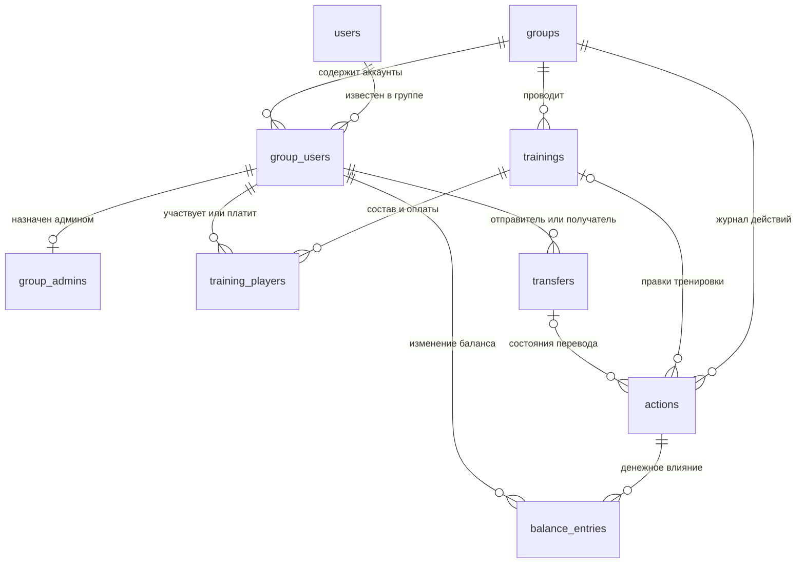
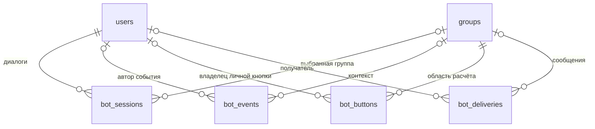

# Новая база: таблицы и связи

Текущий код использует версию схемы 3; таблиц по-прежнему 13. SQL находится в [schema.sql](../src/main/resources/db/schema.sql).
Статус установки — в [DEPLOYMENT_STATUS.md](DEPLOYMENT_STATUS.md).

## Что переиспользуем

| Прежние таблицы | Новая модель | Решение |
| --- | --- | --- |
| tg_users + participants | users + group_users | Аккаунт определяется Telegram ID. Псевдопрофили и привязки удаляются из модели. |
| app_groups + tg_groups | groups | Одна таблица настроек и идентификатора чата. |
| organizers | group_admins | Только назначения администраторов бота; старшая роль проверяется в Telegram. |
| training_drafts + tg_editors | trainings + training_players | Общая тренировка и строки участия. Отдельных личных копий состава нет. |
| group_state | Не нужна | Текущие балансы читаются из проводок, состояния переводов — из transfers. |
| operations + workflow_audit + workflow_commands + outbox | actions | Один журнал команды, её результата и необходимости обновить сообщения. |
| balance_entries | balance_entries | Сохраняем принцип денежных проводок, меняем ссылки на действия и Telegram-аккаунты. |
| tg_updates + tg_plans | bot_events | Одно входящее событие вместе с планом и результатом обработки. |
| tg_sessions | bot_sessions | Диалог конкретного пользователя в конкретном чате. |
| tg_actions + tg_links | bot_buttons | Общий механизм токенов; постоянные ссылки отличаются признаком permanent. |
| tg_deliveries + tg_recoveries | bot_deliveries + действия восстановления в bot_events | Статус отправки и восстановление по идентификатору входящего события. |
| tg_identity | Одна запись аккаунта бота в users | Защита от открытия базы другим ботом без отдельной таблицы. |

Переиспользование здесь означает сохранение полезной модели и проверенных правил.
Физически создаём новый файл SQLite. Старую тестовую базу сохраняем отдельно;
совместимость со старыми экранными командами в новый код не добавляем.

## Общая схема предметных данных

`group_users` — связь аккаунта с учётом конкретной группы. Наличие этой связи
не заменяет проверку членства в Telegram и не означает участие в каждой тренировке.

## 1. users — Telegram-аккаунты

**Одна строка на Telegram-аккаунт во всём боте.**

- `id` — числовой Telegram ID, первичный ключ.
- `first_name`, `last_name`, `username` — последние известные данные для отображения.
- `is_bot` — признак самого бота; допускается одна такая запись.

На неё ссылаются участники групп, авторы действий и технические диалоги.
Один человек может участвовать в нескольких группах с той же записью users.
Username не уникальный ключ базы: он может измениться или перейти к другому аккаунту.

## 2. groups — группы Telegram

**Одна строка на чат, для которого ведутся расчёты.**

- `id` — Telegram chat ID, первичный ключ.
- `title` — название.
- `time_zone` — часовой пояс дат и времени тренировок.

С ней связаны group_users, trainings, transfers, actions и техническое состояние.
При переходе чата в супергруппу изменение идентификатора распространяется
по объявленным внешним ключам через `ON UPDATE CASCADE`.

## 3. group_users — аккаунты в учёте группы

**Одна строка на пару «группа + аккаунт».**

- `group_id` → groups.id.
- `user_id` → users.id.
- `present` — последнее известное присутствие в Telegram-группе.
- `attendance_count` — сохранённое число учтённых посещений для сортировки.
- `has_played` — есть подтверждённое участие, включая открытую тренировку; фильтр нулевых балансов.
- `is_attending` — ручной признак «ходит» (1) / «не ходит» (0); по умолчанию 1.
- `nickname` — необязательное имя для отображения в этой группе, от 1 до 64 символов
  без пробелов по краям. NULL означает использование имени Telegram-аккаунта.
- Первичный ключ — `(group_id, user_id)`.

Связь сохраняется после выхода человека из чата, потому что у него могут
остаться долги и история. Признак present нужен для списков; права доступа
проверяются заново через Telegram. Прошлые посещения считаются по тренировкам.
Ручной признак is_attending независим от статистики, членства в чате и участия
в конкретной тренировке. Он не меняет долги и не запрещает присоединяться.
Новый аккаунт по умолчанию считается «ходящим», но не записывается играющим.

**Запланировано, пока не реализовано в интерфейсе и логике бота:** is_attending
и nickname уже предусмотрены в новой SQL-схеме. В дальнейшем первый будет
использоваться для ручного управления списками, второй — для отображения имени.
В разных группах у одного аккаунта могут быть разные признаки и имена.
Nickname не обязан быть уникальным и не заменяет Telegram ID или @username.
Обновление данных из Telegram не должно перезаписывать эти ручные настройки.

## 4. group_admins — назначенные администраторы бота

**Строка появляется только после назначения администратором бота.**

- `(group_id, user_id)` → group_users; одновременно первичный ключ.
- `granted_by` — кто назначил; также аккаунт этой группы.
- `granted_at` — время назначения.

Администратор Telegram-группы автоматически считается суперадминистратором
при проверке запроса, отдельной строки для этого не требуется. Он может
назначать и снимать администраторов бота. Назначенный администратор не выдаёт
права другим. Старшая роль из другой группы не действует здесь.

## 5. trainings — тренировки

**Одна строка на тренировку, сохраняющаяся после исправлений и отмены.**

- Первичный ключ — `(group_id, id)`.
- `title`, `played_on`, `starts_at` — название, дата и начало.
- `status` — OPEN, CLOSED, REVIEW или CANCELLED.
- `version` — версия текущих данных, проверяется при завершении.
- `applied_version` — какая редакция последней была применена к балансам.
- `created_by`, `created_at` — создатель из этой группы и время создания.
  `created_by` определяет право учёта наряду с ролью администратора этой группы.
  Авторство включает запись в «Мои тренировки» только в OPEN/REVIEW; после учёта
  нужны обычные основания участия или оплаты. Новые поля для этой роли не нужны.

Состав и оплаты находятся в training_players, правки — в actions, денежное
влияние — в balance_entries. Долги не пересчитываются при простом открытии
тренировки на уточнение.

## 6. training_players — участие, время и оплата

**Одна строка на Telegram-аккаунт в конкретной тренировке.**

- `(group_id, training_id)` → trainings.
- `(group_id, user_id)` → group_users.
- Первичный ключ — `(group_id, training_id, user_id)`.
- `playing` — играет ли сейчас по введённым данным.
- `minutes` — время; по умолчанию 0, неотрицательное число с шагом 30 минут.
- `guest_count` — число гостей, от 0 до 99.
- `guest_minutes` — время каждого гостя; новый ввод синхронизирует его с minutes.
  Отдельное старое гостевое время сохраняется при миграции до следующей правки участия.
- `paid` — оплата стола в целых рублях, не перевод другому участнику.
- `ordinal` — стабильный порядок для распределения остатка округления.
- `applied_playing` — участвовал ли в последней завершённой редакции.

Последнее поле нужно, чтобы правки открытой на уточнение тренировки временно
не меняли статистику фактических посещений. При завершении оно обновляется.

Пользовательское присоединение создаёт строку сразу с 0 ч и 0 ₽. Последующие
кнопки изменяют её сразу. Выход сохраняет paid и сбрасывает playing, minutes,
guest_minutes и guest_count. Строка плательщика остаётся в таблице тренировки.
У гостей нет собственных аккаунтов: их расходы суммируются на пригласившем.
В форме администратора всё ещё используется подтверждение всей правки.

## 7. transfers — переводы между людьми

**Одна строка на реальный перевод, аванс или частичный возврат.**

- Первичный ключ — `(group_id, id)`.
- `from_user`, `to_user` — обе стороны связаны с этой же группой через group_users.
- `amount`, `occurred_on`, `note` — сумма, дата и комментарий.
- `status` — ACTIVE, REVIEW или CANCELLED.
- `version` — версия для защиты от конфликтующих действий.
- `reviewer` — кто начал уточнение; `review_party` — от какой стороны он действует.
- `created_by`, `created_at` — автор записи и время.

История состояний — в actions, изменение денег — в balance_entries.
Сама сумма и стороны существующей записи не переписываются: ошибочную запись
уточняют и отменяют, затем создают правильную. Уточнение временно снимает
влияние перевода; подтвердить или отменить его может инициатор уточнения.

## 8. actions — единый журнал действий

**Одна строка на успешно обработанную предметную команду.**

- `id` — первичный ключ записи журнала.
- `group_id`, `actor_id` — группа и реальный автор из этой группы.
- `request_id` — уникален внутри группы; повтор возвращает тот же результат.
- `kind` — вид действия.
- `training_id` или `transfer_id` — ссылка на затронутую запись; оба одновременно запрещены.
- `payload_json` — исходная команда для проверки совпадения при повторе.
- `before_json`, `after_json` — история изменения, а не основное хранилище текущих данных.
- `result_version` — сохранённая версия результата.
- `occurred_at` — время записи.
- `needs_delivery`, `delivered_at` — требуется ли обновить карточку/уведомления и обработано ли это.

Правка времени сама по себе не создаёт денежных проводок. Завершение
тренировки, отмена и операции с переводами создают связанные balance_entries.
Из нескольких быстрых правок можно обновить общую карточку один раз, взяв
последнее состояние. Результаты конкретных отправок находятся в bot_deliveries.

## 9. balance_entries — финансовые проводки

**Одна строка — изменение баланса одного аккаунта от одного действия.**

- `(group_id, action_id)` → actions.
- `(group_id, user_id)` → group_users.
- `entry_index` — номер строки внутри действия.
- `amount` — сумма со знаком: плюс означает, что человеку должны.
- Первичный ключ — `(action_id, entry_index)`.

Сумма по участнику и группе — текущий баланс. Сумма проводок одного действия
должна быть нулевой; это проверяет код внутри транзакции и проверка целостности.
Внешние ключи защищают принадлежность группе, но арифметическое равенство
нескольких строк не выражается простым CHECK отдельной строки.

При исправлении тренировки снимается её накопленное влияние и добавляется
новое. Проводки переводов при этом не затрагиваются. Проверка переполнения
выполняется точной целочисленной арифметикой.

## Технические связи

## 10. bot_events — входящие события Telegram

**Одна строка на update_id.**

- `update_id` — первичный ключ.
- `user_id`, `group_id` — контекст, если применим.
- `plan_json` — зафиксированное действие для продолжения после сбоя.
- `completed` — обработка завершена.

Эта таблица заменяет отдельные таблицы обновлений и планов. Повтор получения
одного update_id не добавляет деньги второй раз. Два настоящих нажатия +100 ₽
имеют разные update_id и увеличивают сумму дважды.

## 11. bot_sessions — текущие диалоги

**Одна строка на пару «пользователь + чат общения».**

- Первичный ключ — `(user_id, chat_id)`.
- `group_id` — выбранная расчётная группа; в личном чате может переключаться.
- `message_id` — текущее обычное сообщение.
- `ephemeral_id` — персональное представление внутри группы, если используется.
- `input_json` — ожидаемый ответ или черновик формы создания или административной правки.
- `panel_json` — ScreenAction текущей персональной панели; очищается при закрытии.

Для формы администратора используется один черновик на редактора и группу.
Он хранит исходную и редактируемую строку одного игрока, защищая её от перезаписи
параллельных изменений. В пользовательской панели черновика нет: данные записываются
сразу. ephemeral_id и panel_json позволяют обновлять одну открытую панель без дублей.

## 12. bot_buttons — кнопки и постоянные ссылки

**Одна строка на непрозрачный идентификатор действия.**

- `token` — первичный ключ, возвращаемый Telegram.
- `group_id` — расчётная группа.
- `owner_id` — владелец личной кнопки; NULL у общей кнопки группы.
- `scope` — конкретное меню или панель, которому принадлежит набор.
- `permanent` — постоянная ссылка; не очищается как временная кнопка.
- `payload_hash`, `action_json` — поиск совпадающего действия и его описание.
- `active` — кнопка относится к текущему или потенциально доставленному экрану.
- `expires_at` — когда можно удалить заменённую кнопку.

Общее «Открыть» не привязано к создателю карточки: бот определяет
реального нажавшего и проверяет его членство. Личную кнопку другого человека
использовать нельзя. Переход к другой группе никогда не берёт группу из
случайно оставшегося личного контекста вместо самой кнопки.

## 13. bot_deliveries — доставка сообщений

**Одна строка на логическую отправку или общую карточку.**

- `delivery_key` — первичный ключ: например, карточка конкретной тренировки.
- `group_id`, `chat_id`, `user_id` — куда и кому отправляется сообщение.
- `message_id`, `ephemeral_id` — результат успешной отправки.
- `status` — SENDING, SENT, UNKNOWN, FAILED, BLOCKED или RETRY.
- `display_page` — прежний номер страницы общей таблицы; после удаления пагинации
  не читается и не меняется приложением. Поле сохранено в схеме 3, чтобы эта правка
  интерфейса не требовала отдельной миграции рабочей базы.
- `pin_status` — NONE, PENDING, SENDING, SENT, FAILED или UNKNOWN.
  NONE — закрепление не запланировано, UNKNOWN запрещает автоматический повтор уведомления.

Позволяет обновлять существующую карточку и не публиковать дубликат после
неопределённого результата отправки. У одной команды actions может быть
несколько результатов доставки; связь задаётся логическим delivery_key.
Фиксация изменения денег и сетевой запрос к Telegram не объединяются в одну
транзакцию: журнал сохраняет необходимость доставки, чтобы продолжить её позже.

## Что не является отдельной таблицей

- Текущие балансы — производное от balance_entries.
- «Кто кому должен» — предлагаемое распределение переводов по балансам.
- Суперадминистраторы — текущие администраторы Telegram-группы.
- Посещаемость и признак «хоть раз играл» — данные завершённых тренировок.
- Гости — количество и время при пригласившем, без отдельной таблицы аккаунтов.
- Общее JSON-состояние финансов — отсутствует.

Точное восстановление и права проверяются тестами приложения. Сам по себе
список внешних ключей не заменяет проверку текущего членства в Telegram.
