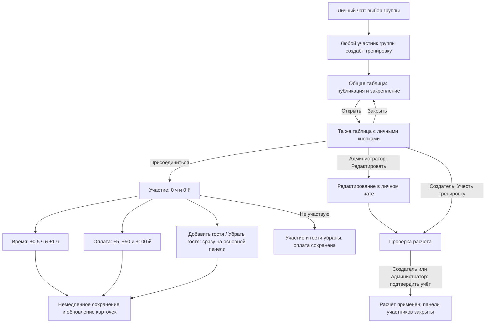
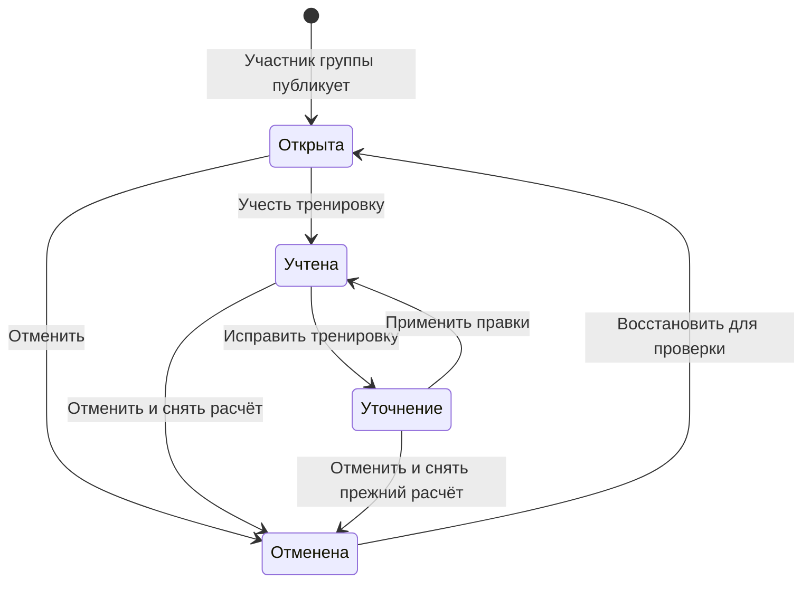
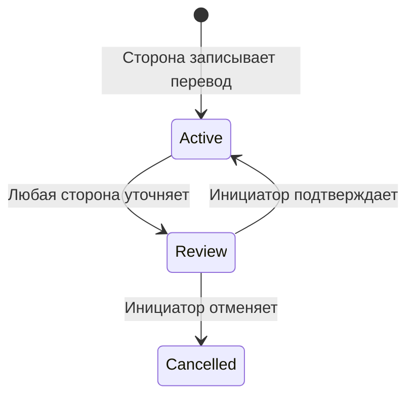

# Переходы и состояния интерфейса

Текущий код следует задачам [#1](https://github.com/Romamor/tennis-split-bot/issues/1)
и [#2](https://github.com/Romamor/tennis-split-bot/issues/2). Они заменяют прежние правила
о 1 ч при входе, одном госте и подтверждении каждого пользовательского ввода.
Состояние установки отдельно описано в [DEPLOYMENT_STATUS.md](DEPLOYMENT_STATUS.md).

Редактируемые [схемы всех трёх ролей в .drawio](diagrams/BOT_USER_FLOWS.drawio)
и [интерактивный прототип](prototype/README.md) сверены с текущим кодом.

## Основной путь

Схема расположения сверена с приложенными макетами: оплата и время отдельными
строками, гостевые кнопки рядом, в подменю положительные поправки над отрицательными,
«Назад» и «Закрыть» в одном ряду. Подписи кнопок сохранены на русском языке.

«Открыть» не записывает участие. Повторное открытие возвращает ту же персональную
панель. Она видна только нажавшему; кнопки не принадлежат автору общей карточки.
Администратор получает ссылку «Редактировать» в личку. После учёта обычный участник
не может вновь открыть панель управления или изменить данные старой кнопкой.
Общая сводная таблица остаётся видимой в группе.

## Таблица и баланс

Содержание общее: название, дата и время, строка «Статус», полный состав одной таблицей.
Колонки: участник со ссылкой на профиль, время, оплата и баланс этой тренировки.
Каждый гость занимает строку «Имя гость N»; оплата относится к пригласившему,
расходы округляются по отдельным местам и затем суммируются на его аккаунте.
До учёта таблица показывает предварительный расчёт, а не общий баланс группы.
При оплате без указанного времени результат пока неизвестен и показан как «—».

В карточке тренировки и персональных панелях нет страниц, независимо от состояния
тренировки. Списки тренировок, выбор игроков и история сохраняют пагинацию. Изменения обновляют
данные в уже открытых панелях; права получателей проверяются заново. Закрытая
или исчезнувшая панель не создаётся фоновым обновлением.

## Состояния тренировки

Во время уточнения действует прежний расчёт. Повторный учёт заменяет его одной
транзакцией. Отмена снимает только влияние тренировки; реальные переводы остаются.
Восстановление сохраняет ту же запись и последний ввод, но требует нового учёта.

## Состояния перевода

Переводы независимы от статуса тренировки. В личном меню участника остаются
«Мои тренировки», «Мои расчёты» и «Создать тренировку»; администратору добавлено управление.
Автор видит свою открытую тренировку и тренировку с правками даже без участия.
После учёта авторство перестаёт включать её в список; участие и оплата остаются
обычными основаниями показа. Вышедший из группы создатель не может подтвердить учёт.
Отмена, восстановление, повторное открытие и правка чужих данных доступны администраторам.
В личной форме администратора изменения игрока подтверждаются одной кнопкой,
а выход с несохранённым вводом предлагает продолжить или сбросить его.

## Закрепление и ограничения Telegram

Новая карточка отправляется без отдельного звукового уведомления и закрепляется
с `disable_notification=false`. Фактические уведомления зависят от настроек Telegram.
Для закрепления требуется `can_pin_messages`. При отказе администратор видит причину
и кнопку повтора. При неопределённом результате повтор не выполняется автоматически,
чтобы не уведомлять участников повторно. Обычное обновление карточки её не закрепляет заново.

[Таблицы Telegram](https://core.telegram.org/bots/api#rich-html-style),
[персональные сообщения](https://core.telegram.org/bots/api#ephemeralmessagesandcommands),
[закрепление](https://core.telegram.org/bots/api#pinchatmessage).
Отображение в конкретном клиенте Telegram проверяется отдельно от тестов API.
