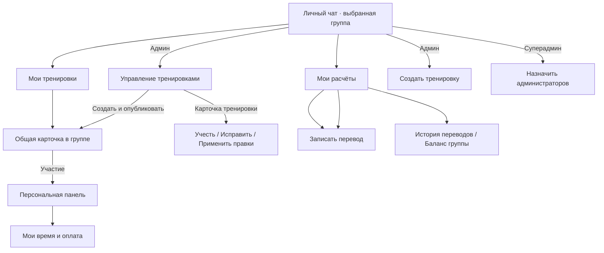
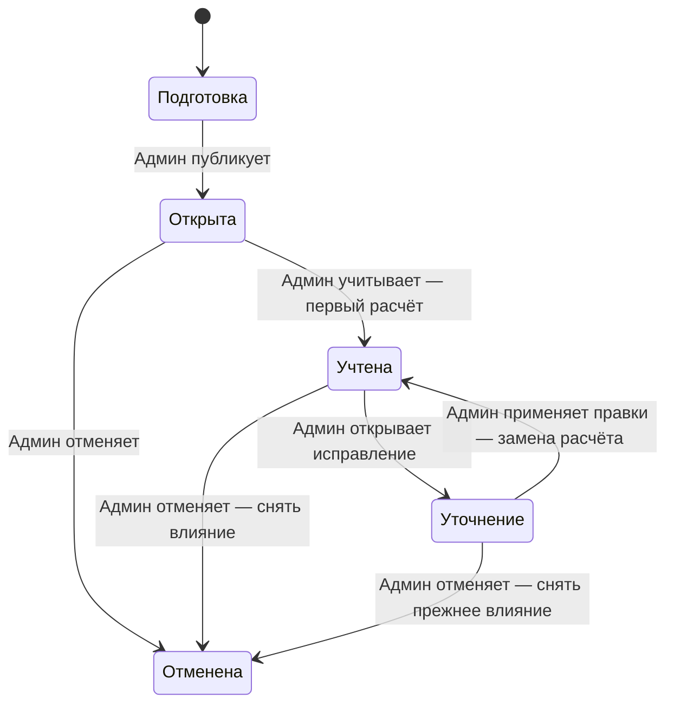
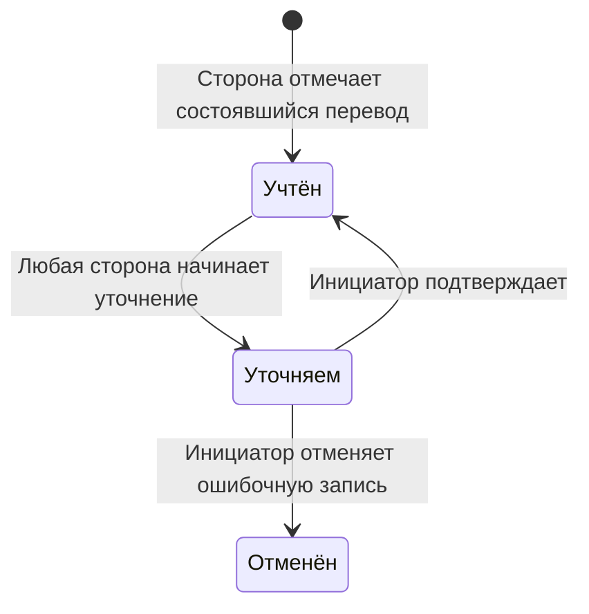

# Новый интерфейс: макеты и переходы на согласование

Обновлено по сверке 10 сентября 2026. Текущий пакет реализован локально; установка требует отдельной команды. Факт установки — в [DEPLOYMENT_STATUS.md](DEPLOYMENT_STATUS.md).

## Границы участия и ролей

Все участники группы имеют право присоединиться к тренировке. Нахождение
в группе само по себе не добавляет игровое время и расходы. «Играл»
ставит 1 ч, первая отметка «Платил» — 300 ₽; время меняется шагом 0,5 ч,
оплата — 50 ₽. Повторная отметка не создаёт второе участие и не сбрасывает поправки.

Участник меняет свои данные в открытой тренировке и в период уточнения.
Администратор бота меняет любые данные тренировки, завершает и возобновляет её.
Суперадминистратор имеет те же возможности и назначает администраторов бота.
Суперадминистраторы определяются текущими администраторами конкретной группы
Telegram; назначенный администратор не выдаёт права дальше.

## Переходы между экранами

Общая карточка одинакова для всех. Персональные кнопки открываются по нажатию
и видны только нажавшему; дополнительные кнопки определяются его ролью.
В прототипе роль выбирается вручную только для просмотра вариантов.

## Состояния тренировки

| Состояние | Кто меняет данные | Что происходит с балансами |
| --- | --- | --- |
| Подготовка | Администратор | Тренировка ещё не влияет на долги |
| Открыта | Участники — свои данные; администратор — любые | Данные собираются, расчёт ещё не учтён |
| Учтена | Для изменений требуется «Исправить тренировку» | Применена последняя завершённая редакция |
| Уточнение | Участники — свои данные; администратор — любые | Продолжает действовать прежний расчёт до повторного завершения |
| Отменена | Просмотр; при необходимости создать другую тренировку | Влияние тренировки снято, реальные переводы сохранены |

Повторное завершение обновляет ту же тренировку. Сохраняется автор и история
правки. Самостоятельные изменения во время уточнения разрешены, как в утверждённом макете.

## Состояния перевода

Перевод влияет на баланс сразу при записи и только в состоянии «Учтён».
Открытие тренировки на уточнение не изменяет состояние переводов.

## Списки и названия

- Состав: «Участники группы», фильтры «Играли раньше» и «Все участники».
- В карточке: «Играют в этой тренировке»; не все люди из группы.
- Балансы: «Есть долг или остаток» и «Расчёты закрыты».
- Ненулевые балансы видны всегда. Нулевые — только у тех, кто играл раньше.
- В прототипе длинные списки разбиты по 6 строк; точную плотность утвердить по макету.

## Технический вопрос до реализации

Bot API предоставляет количество участников, список администраторов и
проверку конкретного пользователя, но не выгрузку полного состава группы.
Право участия можно дать каждому члену группы; известный боту список аккаунтов
пополняется из взаимодействий и событий. Способ первоначального знакомства
со всеми аккаунтами нужно определить перед реализацией списка «Все участники».
[Методы Telegram](https://core.telegram.org/bots/api#getchatmember).

Персональные сообщения внутри группы поддерживаются через ephemeral messages.
Нужно проверить их на используемых участниками клиентах Telegram до выбора
этого способа основным. [Документация](https://core.telegram.org/bots/api#ephemeralmessagesandcommands).

## Проверка прототипа

Проверены синтаксис и сценарии на искусственных данных: присоединение,
300 ₽ и поправки, часы, закрытие и повторное закрытие, сохранение прежних
балансов при уточнении, перевод и фильтрация нулевых балансов. Просмотр
из выделенной папки заработал; в браузере пройдены присоединение, оплата,
администраторское завершение и возобновление, проверена ширина 360 и 736 в светлом и тёмном оформлении.
Это проверка макета, не настоящего Telegram-клиента.

## Уточнения интерфейса 10 сентября

На общей карточке основная кнопка «Играл». Повторное нажатие открывает ту же
персональную панель без сброса значений. Подписи — «Играл N ч», «Играли: N».
Оплата стола доступна только при участии; «Не играл» при ненулевой оплате
показывает подтверждение удаления этой суммы. Переводы между людьми сохраняются.

В группе нет кнопки «Другая сумма». «Всё правильно» сохраняет личный ввод одной
правкой и закрывает панель. До подтверждения общая карточка и история не меняются.
При повторном открытии незавершённый ввод сохраняется. Действия для личного чата открываются
прямой ссылкой; поясняющее сообщение с отдельным «Продолжить у бота» не создаётся.
