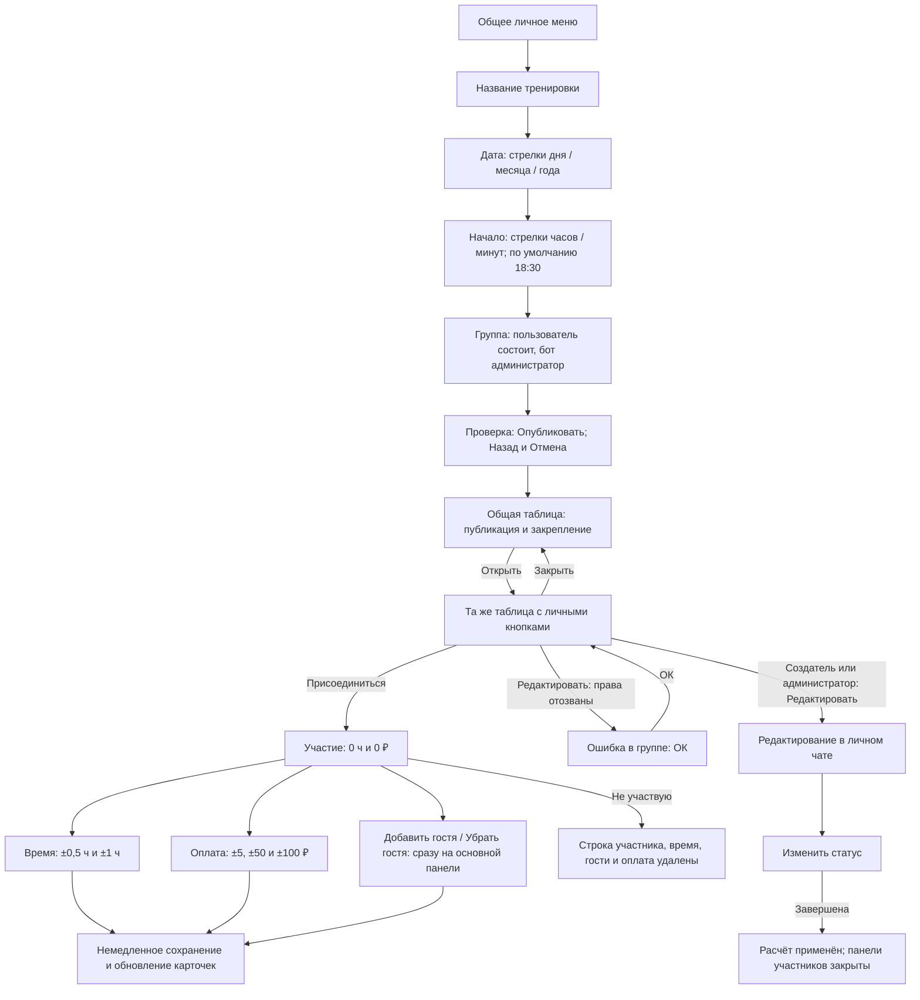
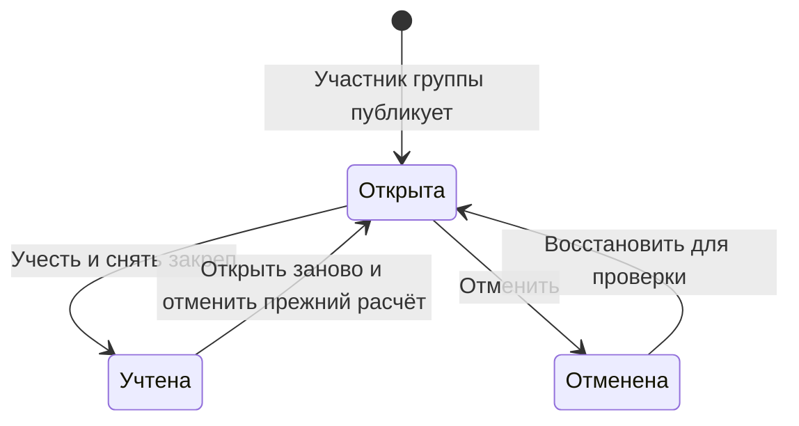
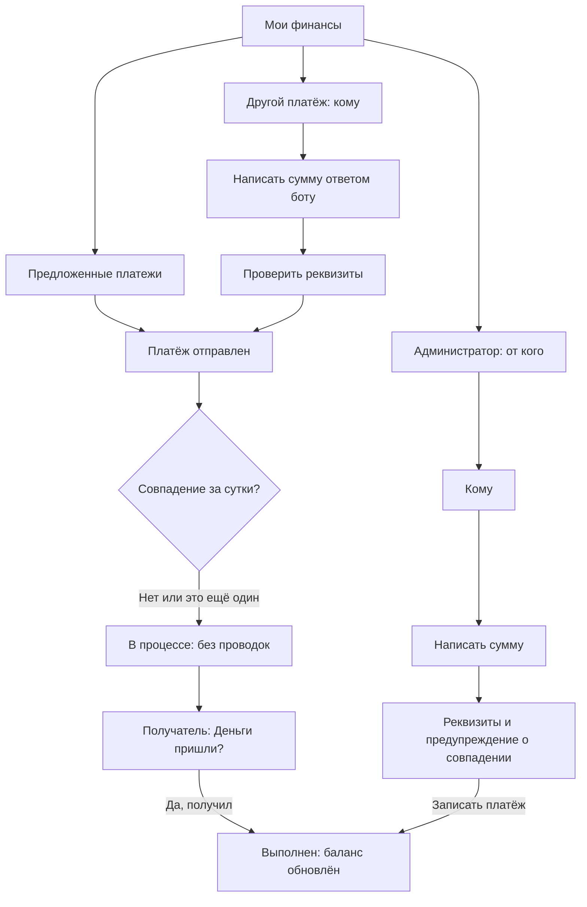

# Переходы и состояния интерфейса

Текущий код следует задачам [#1](https://github.com/Romamor/tennis-split-bot/issues/1)
и [#2](https://github.com/Romamor/tennis-split-bot/issues/2). Они заменяют прежние правила
о 1 ч при входе, одном госте и подтверждении каждого пользовательского ввода.
Состояние установки отдельно описано в [DEPLOYMENT_STATUS.md](DEPLOYMENT_STATUS.md).

Редактируемые [схемы всех трёх ролей в .drawio](diagrams/BOT_USER_FLOWS.drawio)
и [интерактивный прототип](prototype/README.md) сверены с текущим кодом.

## Основной путь

Схема расположения сверена с приложенными макетами: оплата и время отдельными
строками, гостевые кнопки рядом, в подменю положительные поправки над отрицательными,
«Назад» и «Закрыть» в одном ряду. Подписи кнопок сохранены на русском языке.

«Открыть» не записывает участие. Повторное открытие возвращает ту же персональную
панель. Она видна только нажавшему; кнопки не принадлежат автору общей карточки.
В общей карточке остаётся ровно одна кнопка «Открыть» в одной строке — это условие
показа действия в полосе закрепа Telegram. «Редактировать» находится в основной
персональной панели создателя или администратора группы, в том числе до участия.
В подменю времени / оплаты и при управлении игроками её нет. Права проверяются
при нажатии и входе в личный редактор; при отзыве прав появляется ошибка с «ОК».
Редактор из личного списка тренировок остаётся доступен и для закрытых состояний.
После учёта
или отмены никто, включая администратора, не открывает участие и не меняет данные
старыми кнопками: Telegram показывает окно «Тренировка завершена» / «Тренировка отменена» с «ОК».
Общая сводная таблица остаётся видимой в группе.

## Таблица и баланс

Содержание общее: название, дата и время, строка «Статус», полный состав одной таблицей.
Колонки: участник со ссылкой на профиль, время, оплата и баланс этой тренировки.
Каждый гость занимает строку «Имя гость N»; оплата относится к пригласившему,
расходы округляются по отдельным местам и затем суммируются на его аккаунте.
До учёта таблица показывает предварительный расчёт, а не общий баланс группы.
При оплате без указанного времени результат пока неизвестен и показан как «—».

В карточке тренировки и персональных панелях нет страниц, независимо от состояния
тренировки. Списки тренировок, выбор игроков и история сохраняют пагинацию. Изменения обновляют
данные в уже открытых панелях; права получателей проверяются заново. Закрытая
или исчезнувшая панель не создаётся фоновым обновлением.

## Состояния тренировки

При повторном открытии прежний расчёт сразу отменяется. Следующий учёт применяет
новый расчёт одной транзакцией. Отмена снимает закреп и только влияние тренировки; реальные переводы остаются.
Восстановление сохраняет ту же запись и последний ввод, но требует нового учёта.

## Мои финансы

Главное меню → «💰 Мои финансы» → выбор группы → финансовое меню.
Строки: отправка / принятие со счётчиком; другой платёж / история; баланс группы;
отдельная административная запись при наличии прав; назад в главное меню.

Обычный произвольный платёж проверяется на совпадение за последние сутки в момент
записи. «Посмотреть предыдущий» возвращает к уточнению без потери ввода.
«Назад» сохраняет сумму; «Отмена» возвращает в финансы без записи.
В административном пути совпадение — предупреждение на том же экране,
без дополнительного подтверждения. Запись сразу учтена, автор виден в деталях.
Старые команды уточнения / правки не меняют новые платежи.

Счётчик принятия — все ожидающие платежи текущему получателю в текущей группе,
не только текущая страница. После принятия уменьшается. При нуле кнопка остаётся.
Принятие требует отдельного нажатия «Да, получил», затем показано «Платёж учтён».

Отправка / принятие — по три записи, история / баланс — по пять, выбор аккаунтов —
по шесть. Балансы сортируются по убыванию до пагинации; нулевые — после всех
ненулевых, только для ранее участвовавших. Таблицы используют стиль тренировок.
Новые финансовые маршруты используют личный чат; в группу сообщения не отправляют.

## Дата, начало и настройки группы

В форме даты три колонки: день, месяц, год. Над и под числами — стрелки.
Переход месяца / года ограничивает день последним существующим днём: например,
31 января → 28/29 февраля. Год ограничен диапазоном 1–9999. В форме начала две колонки: часы и минуты. Над значениями стоят «▲ Часы» /
«▲ Минуты», под ними — «▼ Часы» / «▼ Минуты». Шаг — 1 час и 30 минут
соответственно. Нажатие на само число ничего не меняет.
Минуты переносятся в часы: 18:30 → 19:00 при нажатии «▲ Минуты».
Переход через полночь меняет только часы, не выбранную дату. Ручной ввод остаётся.

Любой пользователь открывает «Настройки» → «Тренировка» и меняет личное название
или время по умолчанию. Исходные значения — «Теннис» / 18:30. Название предлагается
кнопкой в первом шаге, время подставляется в третий. Группа на эти значения не влияет.
В настройках тренировки «Назад» / «Меню» стоят в одном ряду.

Создание: название → дата → время → группа → проверка. На первом шаге только отмена;
на остальных назад и отмена в одном ряду. Назад сохраняет поля и возвращает ровно
к предыдущему шагу, с проверки — к выбору группы (на прежнюю страницу).
Отмена сразу очищает новый черновик и открывает главное меню, без дополнительного предупреждения.
Группы показываются по 8; членство пользователя и права администратора у бота
проверяются при выборе и снова перед созданием записи.

## Единственное личное меню

Кнопки редактируют текущую панель. После текстового ввода ответ переносится вниз;
только после подтверждённой доставки удаляется предыдущее меню. При невозможности
удалить старое сообщение оно превращается в короткую пометку без кнопок.
Неопределённая доставка новой панели не удаляет прежнюю. Уборка переживает перезапуск.
Старое меню, обнаруженное по нажатию в истории, также убирается.

## Закрепление и ограничения Telegram

Новая карточка отправляется без отдельного звукового уведомления и закрепляется
с `disable_notification=false`. Фактические уведомления зависят от настроек Telegram.
Для закрепления требуется `can_pin_messages`. При отказе администратор видит причину
и кнопку повтора. При неопределённом результате повтор не выполняется автоматически,
чтобы не уведомлять участников повторно. Обычное обновление карточки её не закрепляет заново. Учёт и отмена снимают
только её собственное сообщение с закрепа по паре chat_id/message_id.
Старые закрытые и отменённые записи также обрабатываются после установки.
Успешное снятие не повторяется при каждом запросе; неопределённый результат
безопасно повторяется, отказ прав даёт администратору «Повторить снятие закрепа».
После восстановления автоматического закрепления нет. Восстановление до завершения
отложенного снятия отменяет эту очередь, чтобы не менять уже открытую карточку.

[Таблицы Telegram](https://core.telegram.org/bots/api#rich-html-style),
[персональные сообщения](https://core.telegram.org/bots/api#ephemeralmessagesandcommands),
[закрепление](https://core.telegram.org/bots/api#pinchatmessage),
[снятие закрепа](https://core.telegram.org/bots/api#unpinchatmessage),
[удаление сообщений](https://core.telegram.org/bots/api#deletemessage).
Отображение в конкретном клиенте Telegram проверяется отдельно от тестов API.

## Управление администраторами

Суперадминистратор: главное меню → «⚙️ Настройки» → «Администраторы групп» → выбор группы.
«⬅️ Назад» из списка возвращает в настройки. В главном меню отдельного пункта нет.
Настройки тренировки доступны всем пользователям. Управление назначениями доступно только суперадминистратору выбранной группы.

Открытая карточка заканчивается таблицей: пояснение о предварительном расчёте убрано.

## Общий список пользователя

Главное меню → «Мои тренировки»: общая статистика по всем записям списка,
включая отменённые, и три тренировки на страницу по убыванию времени создания.
Карточка просмотра → «Назад» возвращает на ту же страницу. «Открыть» видно только
для OPEN; «Редактировать» — создателю или администратору группы. Управление тренировкой
открывается отдельным экраном, а не непосредственно из списка. Подпись об отмене убрана.
Тексты личных меню и форм не содержат названия группы; названия остаются на кнопках выбора.

## Редактор тренировки

Верхняя часть — стандартная карточка. Доступ имеют текущий участник-создатель
и администратор этой группы. Кнопки: изменить статус; изменить название и время;
добавить / исключить игрока одним рядом; управление игроками; история изменений.
Из «Моих тренировок» внизу «Назад» / «Меню»; из общей карточки — только «Меню».

Статус выбирается из разрешённых целей: OPEN → CLOSED или CANCELLED,
CLOSED → OPEN, CANCELLED → OPEN. CLOSED показан в карточке как «Учтена»,
кнопка завершения называется «Завершена». Прямой переход CLOSED → CANCELLED запрещён.
При открытии CLOSED прежний расчёт снимается; реальные переводы сохраняются.

Добавление показывает текущих известных участников группы, не играющих в тренировке,
по восемь на страницу. Нажатие добавляет сразу; «Добавить через Telegram» возвращает
в тот же список после выбора аккаунта. Исключение показывает игроков и плательщиков;
с ненулевой оплатой исключить нельзя. Изменение состава доступно только в OPEN.

Управление игроками → выбор → участие / время / оплата / гости. Тот же немедленный
ввод, что у самого участника; во всех вложенных меню только «Назад». Возврат из
подменю сохраняет выбранного игрока, из участия — страницу списка. Закрытие или
отмена тренировки блокирует в том числе ранее открытые кнопки администратора.

## Ожидающий платёж и новый доступный остаток

Ожидающие 150 ₽ не отображаются в отправке. После новой учтённой тренировки
может появиться ещё 250 ₽ тому же получателю — это отдельное предложение.
После отправки обе записи сохраняются независимо; принятие одной не скрывает
другую из ожидающих. В списке отправки по-прежнему нет уже отправленных сумм.
Таблицы «История платежей» и «Баланс группы» оформлены так же, как таблица тренировки:
`bordered striped compact`, суммы выровнены вправо. Общая настройка — RichTable.

## Стартовое меню группы и закреп

`/start` или `/menu` в группе → одно сообщение «Открыть меню» → постановка
этого сообщения в закреп без уведомления участников. Повтор команды обновляет
существующее сообщение и восстанавливает его закреп; удалённое меню заменяется новым.
Закрытие или отмена тренировки не снимают закреп меню. При обновлении бота ранее
доставленные меню без попытки закрепления также ставятся в закреп.

При временном сетевом сбое тихое закрепление повторяется, в том числе после
перезапуска. После явного отказа Telegram автоматических попыток нет; исправить
права и повторить `/start` или `/menu`. Неопределённая отправка самого сообщения
без известного message_id не приводит к повторной публикации или закреплению
случайного сообщения.

## Интерактивная проверка финансового меню

[Описание и макет](prototype/FINANCE_PROPOSAL.md) согласованы и реализованы.
Переходы также включены в схемы по ролям; факт установки проверяется отдельно
в [DEPLOYMENT_STATUS.md](DEPLOYMENT_STATUS.md).

## Цвета и значки кнопок

Синий стиль — открытие карточки / меню и присоединение; красный — «Не участвую».
Все одиночные кнопки в строках содержат тематический значок. Оформление задаётся
после построения рядов, поэтому динамические списки тоже получают значки,
а существующие иконки не дублируются. Цвета — штатные стили Telegram, не картинки.
Переходы, подтверждения и ограничения закрытых тренировок не меняются.

## Опрос перед тренировкой (схема 7)

- Меню → Настройки → Настройки групп → группа → Сбор через опрос: включён / выключен.
  Только администраторы этой группы; настройка не заменяет обычное создание.
- Меню → Создать опрос → название → дата → время → четвёртый вариант → группа → Опубликовать.
  Первый шаг имеет отмену, последующие — назад и отмену в одной строке.
- Публикуется неанонимный опрос с 4 вариантами: −30 мин / начало / +30 мин / отказ.
  Любое время означает запись; отказ или отзыв голоса удаляют запись. Персональная
  панель при голосовании не появляется. Название четвёртого варианта задаёт автор.
- Под опросом → Завершить сбор → подтверждение → закрытие опроса → обработка
  очереди голосов → создание открытой тренировки → снятие закрепа опроса и закреп карточки.
  Создатель и админы могут завершать; другим — попап с ошибкой.
- Все записавшиеся начинают с **0 ч и 0 ₽**. Время прихода не является длительностью игры.
  Отказавшихся / не ответивших в тренировке нет. До завершения тренировку не создаём.
- Меню → Мои опросы → группа → список по 5 → опрос → завершение.
  Список включает собственные опросы и все опросы группы для её администраторов.
- Отключение настройки скрывает группу из создания новых опросов, но оставляет доступ
  к завершению уже опубликованных. Старые кнопки повторно проверяют права и настройку.
- UNKNOWN: автоматической повторной публикации / создания тренировки нет. Сообщение
  объясняет риск неполного списка и предлагает отменить опрос с подтверждением.
  FAILED / PENDING: доступна повторная публикация после проверки прав.

Остальные переходы действующего интерфейса сохранены. Схема связей опросов —
[DATABASE_ERD.drawio](diagrams/DATABASE_ERD.drawio), вкладка «Опросы».

## Гости и индивидуальное время (схема 8)

Настройки → Настройки групп → группа: гости, учёт времени и опросы.
Только админы этой группы. Гости и время действуют на новые и открытые тренировки.

- Время выключено → скрыты кнопки / подменю / колонка, равный расчёт для всех.
  Введённые минуты остаются. Время включено → прежние минуты снова видны и учитываются.
- Гости запрещены → убрать кнопку добавления, сохранить гостей в таблице и расчёте;
  «Убрать гостя» остаётся у тех, у кого гости уже есть. Разрешены → добавление возвращается.
- Опросы выключены → новые не публикуются, старый опрос и голосование продолжаются.
  Повторное включение не меняет опубликованные сообщения и список записавшихся.

Общая карточка и действующие персональные панели обновляются на месте. Если открыто
подменю времени и время выключили, панель возвращается к участию. Старое нажатие
из подменю выдаёт попап без изменения минут. Старый черновик с недопустимым вводом
позволяет загрузить сохранённые данные. Версия изменяется, прежнее подтверждение
учёта не проходит: нужно посмотреть текущий расчёт и подтвердить снова.

Учтённые / отменённые тренировки не меняются. При открытии / восстановлении
принимаются актуальные правила, данные сохраняются; новый баланс применяется
только по обычному явному завершению. В новом участии 0 ч, либо 1 ч при отключённом
времени; всегда 0 ₽. Правила берутся при создании тренировки, включая завершение опроса.

## Проверка переходов после рефакторинга

Содержание 289 экранов, кнопки и их цели совпали с версией до рефакторинга.
Навигация / настройки, опросы и текст истории перенесены в отдельные компоненты.
Порядок выдачи и страницы опросов сохранены; фильтрация выполняется в SQL.
Общие ограничения длины сообщения, уведомления и принадлежность кнопок сохранены.

Заголовок опроса содержит только название, дату и начало тренировки. Отдельная
строка с вопросом убрана; четыре варианта ответа и кнопка завершения сохранены.

## Открытие персональной панели из общего сообщения

«Открыть» на карточке тренировки и «Завершить сбор» под опросом отправляют новую
персональную панель и после успешной отправки удаляют предыдущую в этой группе.
Редактирование старого сообщения не гарантирует его повторный показ в Telegram.
Кнопки внутри видимой панели обновляют её на месте. Панели других пользователей
и других групп не затрагиваются. Повтор обработки уже доставленного события
использует сохранённую новую панель, без ещё одной отправки.

Переключатель опросов ограничивает создание новых опросов, но не открытие
тренировок и не завершение уже опубликованного сбора. Само открытие панели
не записывает участие и не завершает сбор: для завершения остаётся подтверждение.
