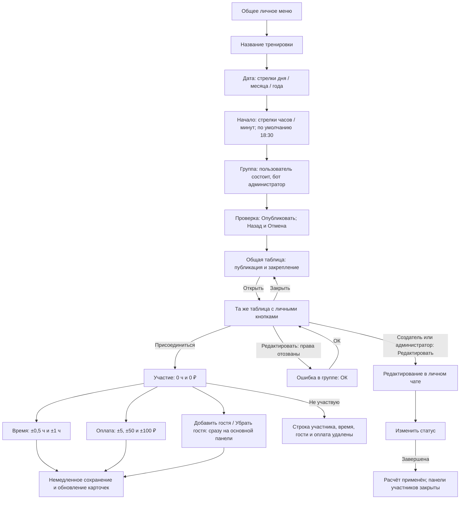
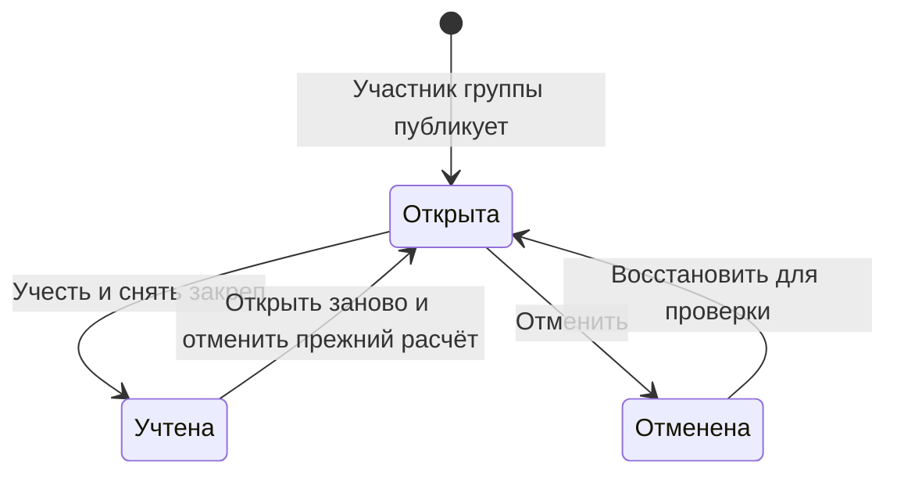
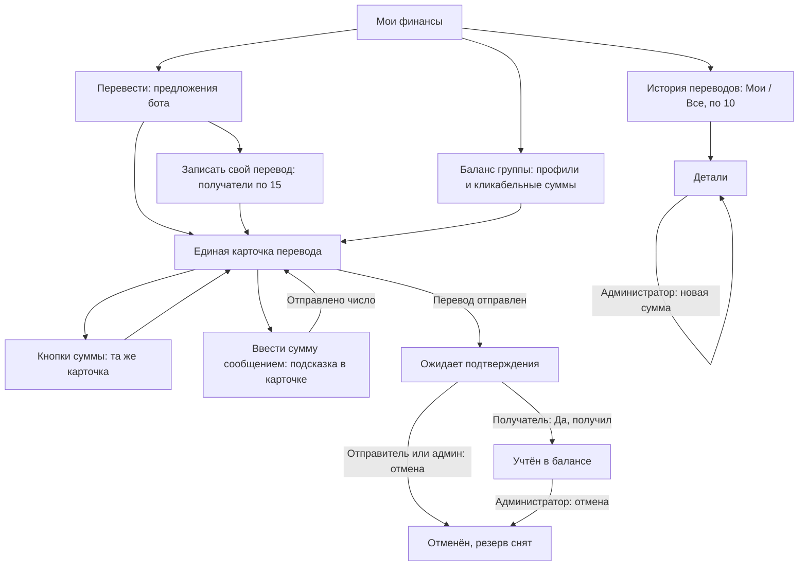

# Переходы и состояния интерфейса

Текущий код следует задачам [#1](https://github.com/Romamor/tennis-split-bot/issues/1)
и [#2](https://github.com/Romamor/tennis-split-bot/issues/2). Они заменяют прежние правила
о 1 ч при входе, одном госте и подтверждении каждого пользовательского ввода.
Состояние установки отдельно описано в [DEPLOYMENT_STATUS.md](DEPLOYMENT_STATUS.md).

Редактируемые [схемы всех трёх ролей в .drawio](diagrams/BOT_USER_FLOWS.drawio)
и [интерактивный прототип](prototype/README.md) сверены с текущим кодом.

## Основной путь

```mermaid
flowchart TD
    Menu[Общее личное меню] --> Create[Название тренировки]
    Create --> DatePicker[Дата: стрелки дня / месяца / года]
    DatePicker --> StartTime[Начало: стрелки часов / минут; по умолчанию 18:30]
    StartTime --> PickGroup[Группа: пользователь состоит, бот администратор]
    PickGroup --> Check[Проверка: Опубликовать; Назад и Отмена]
    Check --> Public[Общая таблица: публикация и закрепление]
    Public -->|Открыть| Personal[Та же таблица с личными кнопками]
    Personal -->|Присоединиться| Joined[Участие: 0 ч и 0 ₽]
    Joined --> Time[Время: ±0,5 ч и ±1 ч]
    Joined --> Payment[Оплата: ±5, ±50 и ±100 ₽]
    Joined --> Guests[Добавить гостя / Убрать гостя: сразу на основной панели]
    Time --> Save[Немедленное сохранение и обновление карточек]
    Payment --> Save
    Guests --> Save
    Joined -->|Не участвую| Leave[Строка участника, время, гости и оплата удалены]
    Personal -->|Закрыть| Public
    Personal -->|Редактировать: права отозваны| EditError[Ошибка в группе: ОК]
    EditError -->|ОК| Personal
    Personal -->|Создатель или администратор: Редактировать| Editor[Редактирование в личном чате]
    Editor --> Status[Изменить статус]
    Status -->|Завершена| Accounted[Расчёт применён; панели участников закрыты]
```

Схема расположения сверена с приложенными макетами: оплата и время отдельными
строками, гостевые кнопки рядом, в подменю положительные поправки над отрицательными,
«Назад» и «Закрыть» в одном ряду. Подписи кнопок сохранены на русском языке.

«Открыть» не записывает участие. Повторное открытие возвращает ту же персональную
панель. Она видна только нажавшему; кнопки не принадлежат автору общей карточки.
В общей карточке остаётся ровно одна кнопка «Открыть» в одной строке — это условие
показа действия в полосе закрепа Telegram. «Редактировать» находится в основной
персональной панели создателя или администратора группы, в том числе до участия.
В подменю времени / оплаты и при управлении игроками её нет. Права проверяются
при нажатии и входе в личный редактор; при отзыве прав появляется ошибка с «ОК».
Редактор из личного списка тренировок остаётся доступен и для закрытых состояний.
После учёта
или отмены никто, включая администратора, не открывает участие и не меняет данные
старыми кнопками: Telegram показывает окно «Тренировка завершена» / «Тренировка отменена» с «ОК».
Общая сводная таблица остаётся видимой в группе.

## Таблица и баланс

Содержание общее: название, дата и время, строка «Статус», полный состав одной таблицей.
Колонки: участник со ссылкой на профиль, время, оплата и баланс этой тренировки.
Каждый гость занимает строку «Имя гость N»; оплата относится к пригласившему,
расходы округляются по отдельным местам и затем суммируются на его аккаунте.
До учёта таблица показывает предварительный расчёт, а не общий баланс группы.
При оплате без указанного времени результат пока неизвестен и показан как «—».

В карточке тренировки и персональных панелях нет страниц, независимо от состояния
тренировки. Списки тренировок, выбор игроков и история сохраняют пагинацию. Изменения обновляют
данные в уже открытых панелях; права получателей проверяются заново. Закрытая
или исчезнувшая панель не создаётся фоновым обновлением.

## Состояния тренировки

```mermaid
stateDiagram-v2
    state "Открыта" as Open
    state "Учтена" as Closed
    state "Отменена" as Cancelled
    [*] --> Open: Участник группы публикует
    Open --> Closed: Учесть и снять закреп
    Closed --> Open: Открыть заново и отменить прежний расчёт
    Open --> Cancelled: Отменить
    Cancelled --> Open: Восстановить для проверки
```

При повторном открытии прежний расчёт сразу отменяется. Следующий учёт применяет
новый расчёт одной транзакцией. Отмена снимает закреп и только влияние тренировки; реальные переводы остаются.
Восстановление сохраняет ту же запись и последний ввод, но требует нового учёта.

## Закрытие персональной панели

При запуске временный отказ `getMe` повторяется без перезапуска JVM. Получение
и обработка входящих сообщений предшествуют фоновым задачам обслуживания;
проверка после выкладки требует нового `/start` в личном чате.

Персональная панель тренировки в группе: «Закрыть» удаляет её и показывает
короткое уведомление «Панель закрыта». Владение кнопкой и соответствие группе
проверяются; повторного запроса членства для скрытия собственной панели нет.
Временный сбой удаления оставляет событие для повторной обработки. Постоянный
отказ показывает окно «Не удалось закрыть панель. Попробуй ещё раз.».
При открытии из общей карточки существующая панель обновляется на месте;
если обновление отклонено, второй экземпляр не создаётся.
Доставленная новая панель и признак завершённой отправки сохраняются одной
транзакцией. Повтор события после сбоя использует эту панель, даже если Telegram
повторно назначил ей идентификатор прежнего удалённого сообщения.
Нажатие устаревшей кнопки закрывает только панель нажавшего пользователя,
даже если в сообщении callback нет необязательного поля получателя.

Telegram не гарантирует получение клиентом события удаления персонального
сообщения, особенно если клиент был не в сети. Поэтому успешный ответ API
подтверждает удаление на стороне Telegram, но не состояние каждого клиента.
[Ограничение Telegram](https://core.telegram.org/bots/api#deleteephemeralmessage).

## Мои финансы: перевод и подтверждение

Для единственной группы выбор пропускается; при нескольких выбирается группа.
«Перевести» показывает предложения и «Записать свой перевод». «Принять платёж»
открывает ожидающие получения. «Баланс группы» и «История переводов» отдельными
строками; у администратора дополнительно запись за участников.
Все входы в сумму используют одну карточку; ожидание резервирует предложение,
но не меняет баланс. Подробная схема и права — в разделе «Финансовое меню:
согласованный интерфейс» ниже. История и чужие детали доступны всем участникам,
действия над чужими записями — только администраторам группы.

## Дата, начало и настройки группы

В форме даты три колонки: день, месяц, год. Над и под числами — стрелки.
Переход месяца / года ограничивает день последним существующим днём: например,
31 января → 28/29 февраля. Год ограничен диапазоном 1–9999. В форме начала две колонки: часы и минуты. Над значениями стоят «▲ Часы» /
«▲ Минуты», под ними — «▼ Часы» / «▼ Минуты». Шаг — 1 час и 30 минут
соответственно. Нажатие на само число ничего не меняет.
Минуты переносятся в часы: 18:30 → 19:00 при нажатии «▲ Минуты».
Переход через полночь меняет только часы, не выбранную дату. Ручной ввод остаётся.

Любой пользователь открывает «Настройки» → «Тренировка» и меняет личное название
или время по умолчанию. Исходные значения — «Теннис» / 18:30. Название предлагается
кнопкой в первом шаге, время подставляется в третий. Группа на эти значения не влияет.
В настройках тренировки «Назад» / «Меню» стоят в одном ряду.

Создание: название → дата → время → группа → проверка. На первом шаге только отмена;
на остальных назад и отмена в одном ряду. Назад сохраняет поля и возвращает ровно
к предыдущему шагу, с проверки — к выбору группы (на прежнюю страницу).
Отмена сразу очищает новый черновик и открывает главное меню, без дополнительного предупреждения.
Группы показываются по 8; членство пользователя и права администратора у бота
проверяются при выборе и снова перед созданием записи.

## Единственное личное меню

Кнопки редактируют текущую панель. После текстового ввода ответ переносится вниз;
только после подтверждённой доставки удаляется предыдущее меню. При невозможности
удалить старое сообщение оно превращается в короткую пометку без кнопок.
Неопределённая доставка новой панели не удаляет прежнюю. Уборка переживает перезапуск.
Старое меню, обнаруженное по нажатию в истории, также убирается.

## Закрепление и ограничения Telegram

Новая карточка отправляется без отдельного звукового уведомления и закрепляется
с `disable_notification=false`. Фактические уведомления зависят от настроек Telegram.
Для закрепления требуется `can_pin_messages`. При отказе администратор видит причину
и кнопку повтора. При неопределённом результате повтор не выполняется автоматически,
чтобы не уведомлять участников повторно. Обычное обновление карточки её не закрепляет заново. Учёт и отмена снимают
только её собственное сообщение с закрепа по паре chat_id/message_id.
Старые закрытые и отменённые записи также обрабатываются после установки.
Успешное снятие не повторяется при каждом запросе; неопределённый результат
безопасно повторяется, отказ прав даёт администратору «Повторить снятие закрепа».
После восстановления автоматического закрепления нет. Восстановление до завершения
отложенного снятия отменяет эту очередь, чтобы не менять уже открытую карточку.

[Таблицы Telegram](https://core.telegram.org/bots/api#rich-html-style),
[персональные сообщения](https://core.telegram.org/bots/api#ephemeralmessagesandcommands),
[закрепление](https://core.telegram.org/bots/api#pinchatmessage),
[снятие закрепа](https://core.telegram.org/bots/api#unpinchatmessage),
[удаление сообщений](https://core.telegram.org/bots/api#deletemessage).
Отображение в конкретном клиенте Telegram проверяется отдельно от тестов API.

## Управление администраторами

Суперадминистратор: главное меню → «⚙️ Настройки» → «Настройки групп» → выбор группы → «Администраторы группы».
«⬅️ Назад» из списка возвращает в настройки. В главном меню отдельного пункта нет.
Настройки тренировки доступны всем пользователям. Управление назначениями доступно только суперадминистратору выбранной группы.

Открытая карточка заканчивается таблицей: пояснение о предварительном расчёте убрано.

## Общий список пользователя

Главное меню → «Мои тренировки»: количество, время и личная стоимость только по
учтённым тренировкам из всех групп. Четвёртая строка — «Осталось внести»: сумма
отрицательных учтённых балансов групп без зачёта переплаты между группами.
Оплаты стола и подтверждённые переводы учтены в остатке; ожидающие — ещё нет.
Гости входят в стоимость пригласившего, но не в его время.
Открытые и отменённые исключены из стоимости и статистики,
но остаются в списке: восемь записей на страницу по убыванию времени создания.
Карточка просмотра → «Назад» возвращает на ту же страницу. «Открыть» видно только
для OPEN; «Редактировать» — создателю или администратору группы. Управление тренировкой
открывается отдельным экраном, а не непосредственно из списка. Подпись об отмене убрана.
Тексты личных меню и форм не содержат названия группы; названия остаются на кнопках выбора.

## Редактор тренировки

Верхняя часть — стандартная карточка. Доступ имеют текущий участник-создатель
и администратор этой группы. Кнопки: изменить статус; изменить название и время;
добавить / исключить игрока одним рядом; управление игроками; история изменений.
Из «Моих тренировок» внизу «Назад» / «Меню»; из общей карточки — только «Меню».

Статус выбирается из разрешённых целей: OPEN → CLOSED или CANCELLED,
CLOSED → OPEN, CANCELLED → OPEN. CLOSED показан в карточке как «Учтена»,
кнопка завершения называется «Завершена». Прямой переход CLOSED → CANCELLED запрещён.
При открытии CLOSED прежний расчёт снимается; реальные переводы сохраняются.

Добавление показывает текущих известных участников группы, не играющих в тренировке,
по восемь на страницу. Нажатие добавляет сразу; «Добавить через Telegram» возвращает
в тот же список после выбора аккаунта. Исключение показывает игроков и плательщиков;
с ненулевой оплатой исключить нельзя. Изменение состава доступно только в OPEN.

Управление игроками → выбор → участие / время / оплата / гости. Тот же немедленный
ввод, что у самого участника; во всех вложенных меню только «Назад». Возврат из
подменю сохраняет выбранного игрока, из участия — страницу списка. Закрытие или
отмена тренировки блокирует в том числе ранее открытые кнопки администратора.

## Ожидающий платёж и новый доступный остаток

Ожидающие 150 ₽ не отображаются в отправке. После новой учтённой тренировки
может появиться ещё 250 ₽ тому же получателю — это отдельное предложение.
После отправки обе записи сохраняются независимо; принятие одной не скрывает
другую из ожидающих. В списке отправки по-прежнему нет уже отправленных сумм.
Таблицы «История переводов» и «Баланс группы» оформлены так же, как таблица тренировки:
`bordered striped compact`, суммы выровнены вправо. Общая настройка — RichTable.

## Стартовое меню группы и закреп

`/start` или `/menu` в группе → одно сообщение «Открыть меню» → постановка
этого сообщения в закреп без уведомления участников. Повтор команды обновляет
существующее сообщение и восстанавливает его закреп; удалённое меню заменяется новым.
Закрытие или отмена тренировки не снимают закреп меню. При обновлении бота ранее
доставленные меню без попытки закрепления также ставятся в закреп.

При временном сетевом сбое тихое закрепление повторяется, в том числе после
перезапуска. После явного отказа Telegram автоматических попыток нет; исправить
права и повторить `/start` или `/menu`. Неопределённая отправка самого сообщения
без известного message_id не приводит к повторной публикации или закреплению
случайного сообщения.

## Интерактивная проверка финансового меню

[Описание и макет](prototype/FINANCE_PROPOSAL.md) согласованы и реализованы.
Переходы также включены в схемы по ролям; факт установки проверяется отдельно
в [DEPLOYMENT_STATUS.md](DEPLOYMENT_STATUS.md).

## Цвета и значки кнопок

Синий стиль — открытие карточки / меню и присоединение; красный — «Не участвую».
Все одиночные кнопки в строках содержат тематический значок. Оформление задаётся
после построения рядов, поэтому динамические списки тоже получают значки,
а существующие иконки не дублируются. Цвета — штатные стили Telegram, не картинки.
Переходы, подтверждения и ограничения закрытых тренировок не меняются.

## Опрос перед тренировкой (схема 7)

- Меню → Настройки → Настройки групп → группа → Сбор через опрос: включён / выключен.
  Только администраторы этой группы; настройка не заменяет обычное создание.
- Меню → Создать опрос → название → дата → время → четвёртый вариант → группа → Опубликовать.
  Первый шаг имеет отмену, последующие — назад и отмену в одной строке.
- На экране перед публикацией «Добавить фото» → отправка одного фото в личный чат →
  возврат на экран публикации. Здесь можно заменить или убрать фото. Без нажатия
  этой кнопки обычный путь не получает нового шага. Фото появляется в самом опросе.
- Публикуется неанонимный опрос с 4 вариантами: −30 мин / начало / +30 мин / отказ.
  Любое время означает запись; отказ или отзыв голоса удаляют запись. Персональная
  панель при голосовании не появляется. Название четвёртого варианта задаёт автор.
- Под опросом → Завершить сбор → подтверждение → закрытие опроса → обработка
  очереди голосов → создание открытой тренировки → снятие закрепа опроса и закреп карточки.
  Если в опросе было фото, оно включается в ту же карточку над таблицей и
  сохраняется при последующих правках тренировки. Дополнительного закрепа нет.
  Создатель и админы могут завершать; другим — попап с ошибкой.
- Все записавшиеся начинают с **0 ч и 0 ₽**. Время прихода не является длительностью игры.
  Отказавшихся / не ответивших в тренировке нет. До завершения тренировку не создаём.
- Меню → Мои опросы → группа → список по 5 → опрос → завершение.
  Список включает собственные опросы и все опросы группы для её администраторов.
- Отключение настройки скрывает группу из создания новых опросов, но оставляет доступ
  к завершению уже опубликованных. Старые кнопки повторно проверяют права и настройку.
- UNKNOWN: автоматической повторной публикации / создания тренировки нет. Сообщение
  объясняет риск неполного списка и предлагает отменить опрос с подтверждением.
  FAILED / PENDING: доступна повторная публикация после проверки прав.

Остальные переходы действующего интерфейса сохранены. Схема связей опросов —
[DATABASE_ERD.drawio](diagrams/DATABASE_ERD.drawio), вкладка «Опросы».

## Гости и индивидуальное время (схема 8)

Настройки → Настройки групп → группа: гости, учёт времени и опросы.
Только админы этой группы. Гости и время действуют на новые и открытые тренировки.

- Время выключено → скрыты кнопки / подменю / колонка, равный расчёт для всех.
  Введённые минуты остаются. Время включено → прежние минуты снова видны и учитываются.
- Гости запрещены → убрать кнопку добавления, сохранить гостей в таблице и расчёте;
  «Убрать гостя» остаётся у тех, у кого гости уже есть. Разрешены → добавление возвращается.
- Опросы выключены → новые не публикуются, старый опрос и голосование продолжаются.
  Повторное включение не меняет опубликованные сообщения и список записавшихся.

Общая карточка и действующие персональные панели обновляются на месте. Если открыто
подменю времени и время выключили, панель возвращается к участию. Старое нажатие
из подменю выдаёт попап без изменения минут. Старый черновик с недопустимым вводом
позволяет загрузить сохранённые данные. Версия изменяется, прежнее подтверждение
учёта не проходит: нужно посмотреть текущий расчёт и подтвердить снова.

Учтённые / отменённые тренировки не меняются. При открытии / восстановлении
принимаются актуальные правила, данные сохраняются; новый баланс применяется
только по обычному явному завершению. В новом участии 0 ч, либо 1 ч при отключённом
времени; всегда 0 ₽. Правила берутся при создании тренировки, включая завершение опроса.

## Проверка переходов после рефакторинга

Содержание 289 экранов, кнопки и их цели совпали с версией до рефакторинга.
Навигация / настройки, опросы и текст истории перенесены в отдельные компоненты.
Порядок выдачи и страницы опросов сохранены; фильтрация выполняется в SQL.
Общие ограничения длины сообщения, уведомления и принадлежность кнопок сохранены.

Заголовок опроса содержит только название, дату и начало тренировки. Отдельная
строка с вопросом убрана; четыре варианта ответа и кнопка завершения сохранены.

## Открытие персональной панели из общего сообщения

«Открыть» на карточке тренировки и «Завершить сбор» под опросом обновляют одну
сохранённую панель пользователя в этой группе. Четыре повторных нажатия не
вызывают четыре отправки. Новая панель нужна только при отсутствии сохранённого
ID или явном ответе Telegram об отсутствующем сообщении. Произвольный отказ 400
или временный сбой обновления не считаются отсутствием панели.
Кнопки прежней панели при наличии более новой не меняют данные и не закрывают
новую. Обновление скрытого клиентом окна не гарантирует его повторный показ;
доступ к тренировке сохраняется через личный чат. Уже потерянное событие удаления
бот не может подтвердить со стороны клиента: требуется отдельная проверка Telegram.
Старое окно может вновь появиться после перезапуска клиента. Если нажатия от него
не приходят боту, обработчик старых кнопок не запустится; это отдельное ограничение
доставки событий, а не подтверждение успешной очистки.
Повтор обработки доставленного события использует сохранённую панель.

Переключатель опросов ограничивает создание новых опросов, но не открытие
тренировок и не завершение уже опубликованного сбора. Само открытие панели
не записывает участие и не завершает сбор: для завершения остаётся подтверждение.

В групповом подтверждении завершения сбора остаются две кнопки:
синяя «🏁 Завершить сбор» и «✖️ Закрыть». Дублирующей «Назад» нет.
«Закрыть» скрывает панель без завершения сбора. В личном чате «Назад»
возвращает к описанию опроса. Кнопки перехода к подтверждению и самого завершения
используют синий стиль Telegram `primary`.

После завершения сбора и доставки общей карточки тренировки персональные панели
этого опроса автоматически закрываются у всех, кто их открыл. Пока последние
голоса обрабатываются, остаётся одна кнопка «Закрыть». При временной ошибке
удаление повторяется; перезапуск не теряет ожидающую закрытия панель.

## Текущая карточка опроса в личном чате

Карточка и подтверждение завершения показывают актуальное число записавшихся.
Голоса, отказ и снятие голоса обновляют существующее сообщение после обработки
событий. Пока число и статус не изменились, запроса редактирования в Telegram нет.
После завершения сбора из группы личная карточка тоже показывает завершённый статус
и кнопку «Открыть тренировку», без старой кнопки завершения.

Автоматически обновляется только текущая карточка. Уход в другое меню отключает
обновление; удалённое сообщение не восстанавливается автоматически. Перед показом
новых данных заново проверяются членство и право управлять опросом. Перезапуск
сохраняет связь с сообщением и повторяет неудавшееся обновление. Старые открытые
карточки предыдущей версии распознаются по активным кнопкам и актуализируются.

Управление администраторами находится внутри настроек выбранной группы.
Кнопка «Назад» возвращает в настройки этой же группы. В личных настройках отдельного
пункта администраторов больше нет. Кнопку назначения видят только администраторы
Telegram-группы; назначенные администраторы бота не могут управлять назначениями.

## Выбор схемы переводов после принятия собственного алгоритма

Экраны «Перевести» и ввода суммы используют общий финансовый интерфейс; расчёт меняет получателей
и суммы предложений. Общий расчёт группы выбирает из десяти прямых схем:
сначала допускаются варианты не длиннее минимального найденного плюс один,
затем минимизируется максимум исходящих у человека, затем число переводов.
Персональные списки являются частями этого общего расчёта, без посредников.

Перевод, ожидающий подтверждения, учтён в доступных предложениях, но не в официальном
балансе. При изменении данных или алгоритма старое предложение проверяется заново:
если получатель/сумма уже не соответствуют расчёту, запись отклоняется с просьбой
обновить список. История и текущие платежи при обновлении бота не меняются.

## Очередь обновлений и быстрый показ меню

Изменение участника сохраняется и показывается ему сразу. Остальные персональные
панели обновляются до последней версии порциями по четыре; уже актуальная панель
автора пропускается. Общие карточки обновляются по две за порцию. Между порциями
бот получает новые события. Очередь персональных панелей сохраняется в panel_json
при перезапуске. Отказ 400/403 при редактировании не удаляет ID окна: повтор
откладывается, а следующая попытка открытия использует ту же панель.

Навигационный кэш живёт 30 секунд и не разрешает защищённые действия. Изменение
состава или прав сбрасывает кэш группы. Проверка прав перед действием остаётся
свежей; первые входы и явный выбор группы могут потребовать поиска доступных групп.
Полное обновление всех экранов теперь может занять несколько порций, но не
блокирует весь приём событий одним проходом по всем панелям.

## Средняя стоимость в карточке тренировки

Под таблицей общей карточки, личного просмотра, персональной панели и редактора
показана средняя цена часа на человека по введённым минутам, включая гостей.
Без учёта времени — средняя сумма на участника, включая гостей. Округление до
рублей, половина вверх; при нулевом знаменателе «—». Все три статуса используют
те же данные, переходы и финансовые операции не изменены.

## Общая история переводов группы

«Мои финансы» → «История переводов» → «Мои / Все» → детали → «Назад».
Любой участник видит записи своей группы. Менять чужие суммы и отменять чужие
переводы могут только администраторы. Список по 10, возврат сохраняет режим и страницу.

## Списки тренировок: таблица и отменённые записи

«Мои тренировки»: по 8 записей, столбцы «Дата / Тренировка / Играл».
«Играл» — только личное время, без гостей, из уже загруженной тренировки.
У отменённых тренировок эта ячейка пустая; сохранённое время не удаляется.
«Тренировки группы» сохраняют два столбца «Дата / Тренировка». Статус — цвет фона кликабельного названия: OPEN синий (`primary`),
CLOSED зелёный (`success`), CANCELLED красный (`danger`). Нет отдельного столбца
или второй строки статуса. Границы, чередование фона и выравнивание слева сохранены.
Название — встроенная callback-ссылка на карточку. Отдельного «Открыть» нет;
название ограничено 34 символами, полное доступно в карточке.
У CANCELLED дата и название зачёркнуты; переход остаётся доступным.
Зачёркивание оборачивает ссылку целиком, внутри подписи кнопки остаётся обычный текст.
«Назад» из карточки возвращает на исходную страницу, внизу таблицы — навигация.
Основание: [Rich HTML](https://core.telegram.org/bots/api#rich-html-style),
[RichTextStrikethrough](https://core.telegram.org/bots/api#richtextstrikethrough)
и [RichMessageButton](https://core.telegram.org/bots/api#richmessagebutton).

## Автоматический выбор единственной группы

Во всех маршрутах выше шаг «группа» условный: одна доступная группа открывается
сразу, несколько — через список, ни одной — сообщение об отсутствии доступных групп.
Проверка числа групп выполняется после фильтрации прав и условий действия, а не
по общему числу членств. Финансы и опросы: членство; управление/настройки:
администратор; публикация: членство и бот-администратор; новый опрос: также
включённая настройка опросов. Перед входом и публикацией права проверяются снова.

- Одна группа: финансы → финансовое меню; настройки групп → настройки этой группы.
- «Назад» из настроек группы → личные настройки; из списка опросов → главное меню.
  При нескольких доступных группах эти возвраты ведут к выбору группы.
- Создание тренировки: название → дата → время → проверка с названием группы.
  Создание опроса: название → дата → время → четвёртый ответ → проверка с группой.
- Проверка → «Назад»: к времени / четвёртому ответу при 0–1 доступной группе,
  к выбору группы при нескольких. Данные формы сохраняются; доступность пересчитывается.
- Автоматический выбор не публикует тренировку или опрос: нужна кнопка «Опубликовать».
  Отмена возвращает в главное меню. Фото остаётся необязательным шагом.

Промежуточное сообщение выбора не отправляется. Структура базы не меняется;
автоматический переход сохраняется в обычном плане обработки события.

## Финансовое меню: согласованный интерфейс

```mermaid
flowchart TD
    Finance[Мои финансы] --> Send[Перевести: предложения бота]
    Send --> Own[Записать свой перевод: получатели по 15]
    Finance --> Balance[Баланс группы: профили и кликабельные суммы]
    Send --> Draft[Единая карточка перевода]
    Own --> Draft
    Balance --> Draft
    Draft --> Adjust[Кнопки суммы: та же карточка]
    Adjust --> Draft
    Draft --> Type[Ввести сумму сообщением: подсказка в карточке]
    Type -->|Отправлено число| Draft
    Draft -->|Перевод отправлен| Pending[Ожидает подтверждения]
    Pending -->|Получатель: Да, получил| Posted[Учтён в балансе]
    Pending -->|Отправитель или админ: отмена| Cancelled[Отменён, резерв снят]
    Finance --> History[История переводов: Мои / Все, по 10]
    History --> Detail[Детали]
    Detail -->|Администратор: новая сумма| Detail
    Posted -->|Администратор: отмена| Cancelled
```

Все входы в перевод используют одну форму. Ввод числа не создаёт перевод;
обычная запись ждёт получателя, административная учитывается сразу.
Кнопки суммы остаются на местах; недоступные отключены. Рекомендация зависит
от текущей пары, округление до ближайших 100 доступно только после выбора
рекомендации или баланса. Сумма и подсказка находятся в самом сообщении.

Назад из выбора получателя сохраняет страницу предложений; из деталей истории
сохраняет режим и страницу; из баланса ведёт в финансы. Отмена черновика —
финансы. Это исходный экран и страница, без универсального стека переходов.
Отмена перевода требует подтверждения. Административные правки записываются
в журнал; правка подтверждённого перевода корректирует проводки, ожидание
остаётся ожиданием, отменённый не восстанавливается.

Права и группа проверяются при каждой операции; устаревшая версия не перезаписывает
новые данные. Суммы в сохранённом ожидании справочные. В черновике они кликабельны.
Чужая история доступна всем участникам группы, правка — только администраторам.
Подробные правила: [финансовый интерфейс](prototype/FINANCE_PROPOSAL.md).

Нажатие личной суммы в «Моих финансах» обновляет тот же экран, без финансовой
операции. Сумма активная: красная для минуса, зелёная для плюса, без приглушения.

Финансовые сообщения используют заголовок `h3`, отдельные абзацы данных и
пояснения; сумма черновика — центрированный `aside`. Форматирование выполняется локально,
без новых запросов к базе или Telegram. Тексты обычного представления сохранены.

В таблицах баланса и выбора участников два столбца: «Участник / Баланс».
Подсказка: «Нажми на имя для профиля, на баланс — для перевода». Нулевой
чужой баланс тоже кликабелен; свой не предлагает перевод самому себе.

«Мои опросы» скрывается, если нет незавершённых сборов, которыми пользователь
может управлять. Выбор и автоматический переход учитывают только группы с
такими сборами. При одной группе список открывается сразу, «Назад» ведёт в меню;
при нескольких предлагаются только соответствующие группы. Чужие сборы видят
администраторы этой группы. Завершённые опросы в этом списке не учитываются.

История переводов — только таблица, без дублирующих кнопок записей ниже. Имена
открывают профили, остальные поля — карточку с доступными действиями. Страница
и режим возвращаются после просмотра.

Неуспешная проверка членства не создаёт участника группы. Старые отсутствующие
аккаунты без игр и ненулевого баланса скрыты; история и расчёты сохраняются.

«Баланс группы» показывает только отмечавших участие хотя бы в одной
неотменённой тренировке этой группы. Членство в чате само по себе не добавляет
в список. Выбор получателя своего перевода использует известный доступный состав
группы; оформление таблицы и подсказка остаются общими.

«💰 Принять платёж» без счётчика: отключена и нейтральная при отсутствии
ожидающих получения переводов, зелёная (`success`) при их наличии. Состояние
берётся из уже загруженной сводки выбранной группы при отображении экрана;
дополнительных запросов и опроса по таймеру нет. Количество остаётся в тексте
сводки, но не в подписи кнопки.

При успешном ручном вводе сумма меняется в текущей карточке над кнопками;
сообщение пользователя с числом ставится в существующую очередь удаления.
Удаление выполняется фоном после доставки карточки и повторяется при временном
сбое, не задерживая её обновление. Новый перевод вводом не создаётся.
Сумма выделена по центру блоком `aside`; размер выбирает клиент Telegram.
В макете размер увеличен с28 до60px, сумма по центру. В колонке «Играл» числа
и заголовок выровнены вправо, у отменённых пусто. Кнопка «Предлагается ботом»
возвращает текущую рекомендуемую сумму и остаётся отключённой при совпадении.

Переход из таблицы балансов выбирает только получателя; сумма нового своего
перевода не заполнена (`— ₽`), запись и округление отключены. Это действует
и при ненулевом балансе получателя. Готовое предложение начинает с рассчитанной
суммы; её можно явно выбрать кнопкой «Предлагается ботом N ₽» и в свободном вводе.

Отправитель может изменить сумму своего перевода до подтверждения получателем,
с отметкой автора правки. Изменение сохраняет ожидание и корректирует резерв;
проводок пока нет. После подтверждения изменение доступно только администратору.
Получатель подтверждает версию, которую видел: после правки старая кнопка
попросит открыть актуальную сумму. Отмена учтённого перевода меняет статус
`transfers` на `CANCELLED`, добавляет действие со снимками до/после и обратные
`balance_entries`; старые проводки сохраняются для истории.
