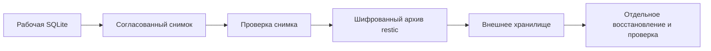

# Практический курс: резервное копирование бота

Цель — построить резервное копирование и уметь самостоятельно объяснить,
проверить и восстановить систему. Курс идёт по одному этапу: короткое объяснение,
практика, разбор результата, затем переход дальше. Не нужно заранее прочитывать
всю документацию или выполнять весь курс одним заходом.

## Что уже есть и что предстоит сделать

В приложении есть команды `backup` и `verify`, копирующие SQLite без миграции
источника и проверяющие копию. Перед изменениями базы копии делались вручную.
Автоматического расписания, внешнего архива и контроля пропущенных копий пока нет.
Состояние установленной версии — в [DEPLOYMENT_STATUS.md](../DEPLOYMENT_STATUS.md).

Согласовано: ночное копирование, семь последних успешных ежедневных копий,
отдельные копии перед обновлением или очисткой с хранением 30 дней. Ошибка загрузки
не должна удалять последнюю исправную копию. Месячные и недельные копии не нужны.
Точное время запуска и канал оповещения выберем при настройке расписания.

Рабочее направление — снимок SQLite, затем restic и внешнее S3-хранилище.
restic — программа для шифрования и управления версиями резервных копий.
Провайдер, учётная запись и доступ пока не подключены. Локальная лаборатория
позволяет изучить первые этапы без облачного аккаунта.

## Маршрут

| Этап | Главный вопрос | Практика и проверяемый результат |
| --- | --- | --- |
| 1. Снимок и восстановление | Чем копия отличается от восстановления? | Создать учебную базу, сохранить снимок, изменить исходник, прочитать восстановленные данные |
| 2. Работающая SQLite | Почему нельзя просто скопировать один файл живой базы? | На искусственной базе увидеть подтверждённую запись в WAL и проверить, что Backup API её сохраняет |
| 3. Шифрование и версии | Кто сможет прочитать копию и как найти нужную версию? | Создать локальный репозиторий restic, сделать несколько снимков, восстановить выбранный, разобраться с ключом и его хранением |
| 4. Внешнее хранилище | Что защищает от потери сервера? | Создать закрытый бакет и отдельные права, отправить снимок, скачать и проверить; измерить число запросов |
| 5. Расписание и хранение | Как понять, что копия не сделана? | Настроить службу и таймер systemd для запуска по расписанию, блокировку параллельных запусков, повторы, контроль давности успешной копии и безопасную очистку |
| 6. Учебная авария | Можно ли восстановиться без исходного сервера? | На отдельном окружении восстановить базу и совместимый код, проверить данные, измерить время и написать инструкцию |

Готово содержание [первой лабораторной работы](01-snapshot-and-restore.md).
Следующие лабораторные работы будем оформлять по мере прохождения: решения
по правам, расписанию и восстановлению должны опираться на выполненную практику.

## Как будем учиться

- Перед командой: что она читает, что изменяет, какой результат ожидаем.
- После команды: что результат доказывает и чего он не доказывает.
- Перед намеренной ошибкой: сначала прогноз, затем проверка на учебных данных.
- В конце этапа: один короткий вопрос на понимание и запись фактического результата.
- Команды, выполненные автором для проверки материалов, не означают, что участник курса уже прошёл практику.

Формат выполнения выбираем вместе: самостоятельно, с демонстрацией или попеременно.
Не требуется запускать рабочие изменения только ради прохождения урока.

## Понятия, к которым будем возвращаться

**RPO — Recovery Point Objective**, допустимая глубина потери данных. При одной
успешной копии в сутки потенциально теряются изменения примерно за последние сутки.
Если задание несколько дней завершалось ошибкой, фактическая потеря будет больше:
поэтому отдельно нужен контроль возраста последней исправной копии.

**RTO — Recovery Time Objective**, допустимое время восстановления работы.
Это цель, а не свойство выбранного облака. Реальное время измерим в учебной аварии,
включая получение доступа, скачивание, проверку и запуск совместимой версии.

**Retention — срок и правила хранения копий.** Семь последних ежедневных копий —
это не семь произвольных запусков. Дополнительные копии перед обновлениями должны
иметь отдельную метку и не вытеснять ежедневные; группировку restic проверим на практике.

**Restore drill — учебное восстановление.** Восстанавливаем в отдельное место,
чтобы доказать работоспособность копии, а не проверять это впервые после аварии.

## Как поймём, что система готова

Есть подтверждённый успешный запуск по расписанию; снимок загружен вне сервера;
восстановление без исходной базы проверено; ключ расшифрования доступен независимо
от сервера; правила хранения проверены на нескольких версиях; ошибка задания и
отсутствие новых копий обнаруживаются; инструкция восстановления воспроизводима.

## Источники

- [SQLite Online Backup API](https://sqlite.org/backup.html).
- [WAL: журнал работающей SQLite](https://sqlite.org/wal.html).
- [Создание репозитория restic](https://restic.readthedocs.io/en/stable/030_preparing_a_new_repo.html).
- [Правила хранения restic](https://restic.readthedocs.io/en/stable/060_forget.html).
- [Восстановление restic](https://restic.readthedocs.io/en/stable/050_restore.html).
